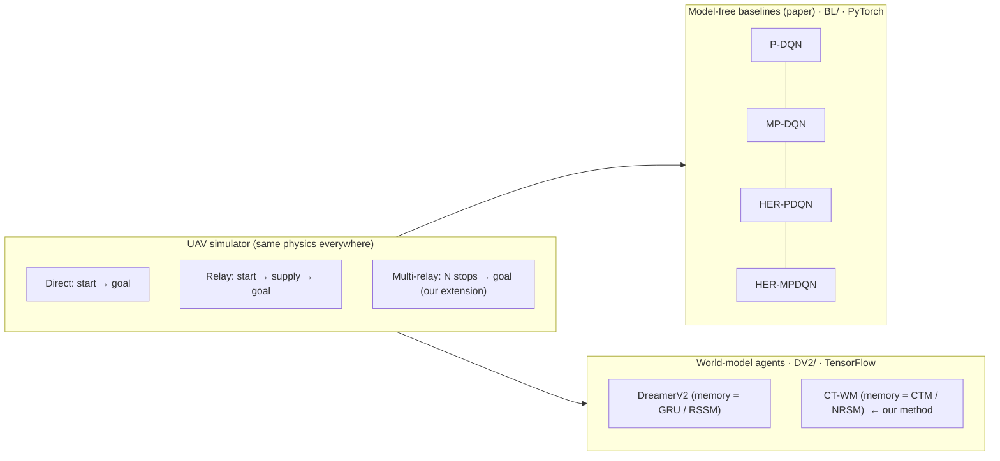
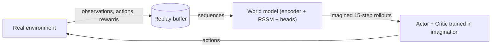
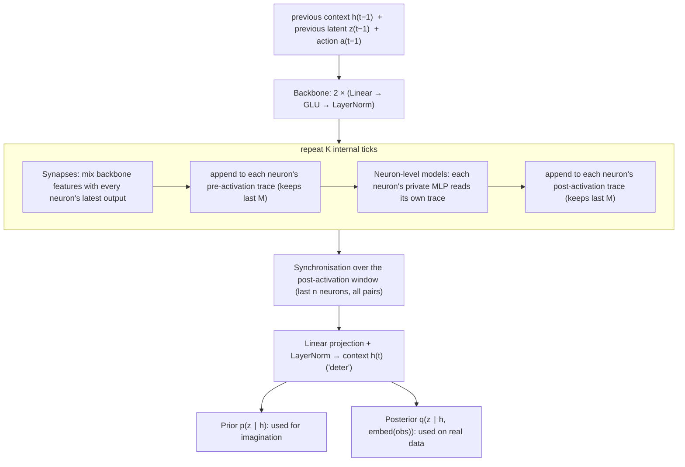
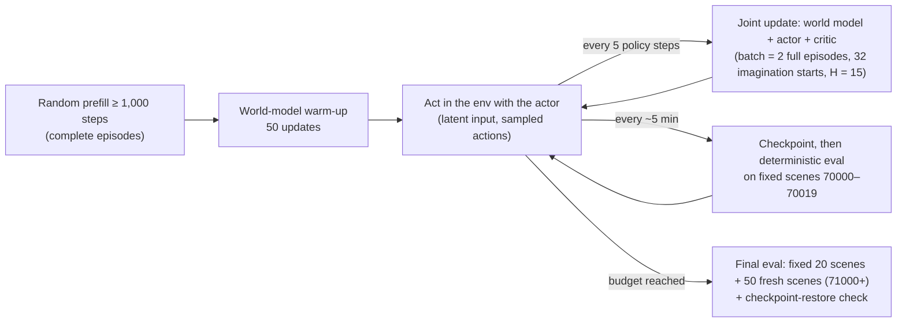

# CT-WM Project Handbook

**A newcomer's guide to our Continuous-Thought World Model for long-distance, sparse-reward UAV navigation**

> **Who this is for:** anyone joining the project who wants to understand *what* we are building, *why*,
> *how the code is organised*, *what has already been tried*, and *how to run it*, without first reading
> ~30,000 lines of code and ~25 dated experiment reports (several of them in Chinese).
>
> **Last verified:** 2026-09-28, against `MadaoShall-1/CTM@14d29c2` and `w7andylaw/ctm_qiwei@898f549`, by
> reading the code and re-running tests and short experiments on an Apple M4 laptop (see [§8.4](#84-first-run-on-a-mac-2026-09-28)).
> **The code and the dated reports in the repo are the source of truth.** If this handbook disagrees with them,
> trust the code and please fix the handbook.

Path shorthands used below (all relative to the root of the `CTM` repo):

- **`BL/`** = `her_mpdqn_reproduction/`: the model-free *baseline* line (PyTorch).
- **`DV2/`** = `Dreamer V2/ctm_qiwei/Dreamer-master/`: the *world-model* line, containing DreamerV2 and our CT-WM/NRSM (TensorFlow).

---

## Contents

0. [The one-minute version](#0-the-one-minute-version)
1. [The problem in plain words](#1-the-problem-in-plain-words)
2. [Background primer (no prior RL needed)](#2-background-primer-no-prior-rl-needed)
3. [The benchmark tasks: exact specification](#3-the-benchmark-tasks-exact-specification)
4. [What we are trying to show](#4-what-we-are-trying-to-show)
5. [Repository map](#5-repository-map)
6. [Code walkthrough](#6-code-walkthrough)
7. [Project history](#7-project-history)
8. [Results so far](#8-results-so-far)
9. [Known issues and open questions](#9-known-issues-and-open-questions)
10. [How to run things](#10-how-to-run-things)
11. [Running on the cluster (A100/H100)](#11-running-on-the-cluster-a100h100)
12. [Team conventions](#12-team-conventions)
13. [FAQ and pitfalls](#13-faq-and-pitfalls)
14. [Glossary](#14-glossary)
15. [Reading list](#15-reading-list)

---

## 0. The one-minute version

**The task.** A simulated delivery drone flies on an empty 2 km × 2 km map. In the **Relay** task it must fly to a
supply point, pick up a package, then fly to a destination and deliver it, all within **100 time steps**. At every
step it chooses **MOVE** (plus *how hard* to accelerate) or **TURN** (plus *how far* to turn). Until it
succeeds it gets essentially **no useful feedback** (a "sparse reward"), which is what makes the problem hard.

**Our idea: CT-WM.** Instead of learning purely by trial and error, the agent first learns a **world model**: a
neural network that predicts what will happen next. It then practises inside that model ("imagination"), like
a pilot in a flight simulator. This is the approach of **DreamerV2** (Hafner et al., 2021). Our twist is to replace
DreamerV2's memory core (a GRU-based **RSSM**) with a **Continuous Thought Machine (CTM)** (Sakana AI, 2025). That is a
network whose neurons each keep a short history of their inputs, "think" for a few internal ticks per step, and
represent information by how pairs of neurons **synchronise** over time. We call this core **NRSM (Neuronal
Recurrent Space Model)**. The full agent is **CT-WM (Continuous-Thought World Model)**.

**What we compare against.**

1. The model-free methods from the benchmark paper (Feng et al., 2023): **P-DQN, MP-DQN, HER-PDQN, HER-MPDQN**.
2. **DreamerV2**, adapted to this task.

**Where we stand (2026-09-28).**

- Environments, all baselines, DreamerV2 and NRSM are implemented, each with unit tests.
- A hand-written controller solves 100% of relay tasks, so the task is feasible.
- Learned agents are far from that:
  - The best DreamerV2 runs deliver in about **16–39%** of fixed test scenes.
  - CT-WM runs end to end and its CTM core is numerically faithful to the official code.
  - In a 1-hour run (137k steps), its **world model learned** to roughly match a "nothing changes" guess at 5–15
    steps ahead. Its **actor did not learn at all**: it stayed a random policy with 0% deliveries.
  - Two follow-up fixes (a stronger actor signal, and a learned-variance reward head) also failed.
  - The root cause found: the world model's position estimate is off by ~200 m, while the drone moves ~22 m per
    step. So imagined per-step rewards carry no usable signal.
  - Early training shows enormous gradients (up to ~1e9). They settle after ~600 updates.
- No comparison so far is a fair, matched benchmark. The open problems are listed in [§9](#9-known-issues-and-open-questions).



---

## 1. The problem in plain words

```
 (0,2000) ┌──────────────────────────────────────────┐ (2000,2000)
          │                              ◎ destination │
          │                                (deliver)   │
          │     ➤ drone starts here                    │
          │       (speed 0, random heading)            │
          │                  ● supply point            │
          │                    (pick up)               │
 (0,0)    └──────────────────────────────────────────┘ (2000,0)
             2 km × 2 km · no obstacles · 100 steps max
```

Four properties make this benchmark hard, and our project is about all four:

| Property | What it means here | Why it is hard |
|---|---|---|
| **Sparse reward** | In the paper version the drone gets −1 every step and 0 only when it delivers. | Until the first lucky success, every attempt looks equally bad, so there is nothing to learn from. |
| **Long distance** | Top speed is 40 m/step, so 100 steps give at most 4 km of flight, minus time lost accelerating and turning. A start → supply → destination route can use most of that budget. | Rewards arrive far in the future, and small steering errors compound over time. |
| **Hybrid actions** | Each action is a discrete choice (MOVE / TURN, plus CATCH in the paper version) **and** a continuous number. | Classic algorithms handle either discrete actions (DQN) or continuous ones (DDPG/SAC), not both at once. |
| **Multiple stages** | The goal switches from the supply point to the destination after pickup. | The agent must know which stage it is in, and learning signals from one stage must not be confused with the other. |

---

## 2. Background primer (no prior RL needed)

### 2.1 Reinforcement learning in ten terms

| Term | Plain meaning | In our code |
|---|---|---|
| **Agent** | The learner that picks actions | `PDQNAgent`, `DreamerV2`, `OnlineAgent` (CT-WM) |
| **Environment** | The world the agent acts in | `DirectNavigationEnv`, `RelayNavigationEnv`, `DreamerV2UAVEnv` |
| **Observation / state** | What the agent sees at each step | 6–8 raw numbers (baselines) or a 13-number vector (Dreamer/NRSM) |
| **Action** | What the agent does | `(MOVE or TURN, parameter ∈ [−1, 1])` |
| **Reward** | A score after each step | 0/−1 (paper) or `goal_safe_v1` (Dreamer/NRSM, [§3.5](#35-the-goal_safe_v1-reward-dreamer--nrsm-line)) |
| **Episode** | One attempt from reset to the end | At most 100 steps |
| **Return** | Sum of rewards over an episode, discounted | What the agent tries to maximise |
| **Discount γ** | How much future rewards count. 0.99 means "the future matters a lot" | `gamma = discount = 0.99` |
| **Policy π** | The agent's behaviour rule: observation → action | Actor network |
| **Value V(s), Q(s, a)** | Expected future return from a state (optionally given an action) | Critic / Q-network |

### 2.2 Model-free vs. model-based RL

- **Model-free** (the DQN family, our baselines) learns values or a policy directly from real experience. It is simple
  and robust, but it usually needs a lot of experience.
- **Model-based** (the Dreamer family, our method) first learns a model of the environment, then learns behaviour
  inside that model. This can be much more sample-efficient, **but only if the model is accurate**. If the model is
  wrong, the agent happily learns to exploit the model's mistakes. We saw exactly this in our DreamerV2 runs ([§7](#7-project-history)).

### 2.3 Q-learning and DQN (basis of all four baselines)

A Q-network scores each action: Q(s, a) ≈ "total future reward if I take a in s and act well afterwards".
It is trained toward the **Bellman target**:

```
target = r + γ · (1 − done) · max_a' Q_target(s', a')
```

Three standard tricks keep this stable. All three appear in `BL/agents/pdqn.py`:

- **Replay buffer:** store past transitions and train on random mini-batches, not only on the latest step.
- **Target network:** a slowly-updated copy (Polyak averaging, `tau`) that is used to compute the target.
- **ε-greedy exploration:** with probability ε take a random action. ε decays linearly from 1.0 to 0.05.

### 2.4 Hybrid actions: P-DQN and MP-DQN

**P-DQN** (Xiong et al., 2018) uses two networks:

1. A **parameter actor** `x(s)` outputs a continuous parameter for *every* discrete action (here `x_MOVE`,
   `x_TURN`; CATCH has none).
2. A **Q-network** `Q(s, x(s))` outputs one score per discrete action. The agent picks `k* = argmax_k Q_k` and
   executes `(k*, x_k*)`.

The Q-network is trained with the Bellman target. The actor is trained to increase `Σ_k Q_k(s, x(s))`.

**The flaw:** the score for MOVE is computed from an input that also contains `x_TURN`, a number that has
nothing to do with MOVE. That creates spurious dependencies.

**MP-DQN** (Bester et al., 2019) fixes this with **multiple passes**. It runs the Q-network once per discrete action,
each time keeping only that action's own parameter and zeroing the rest, and takes `Q_k` from pass `k` (the
"diagonal"). The code is just the mask-and-diagonal trick in `BL/agents/networks.py::multipass_q_values`.

### 2.5 Hindsight Experience Replay (HER)

A failed attempt at reaching goal *g* still reached *some* place *g′*. HER (Andrychowicz et al., 2017) re-labels the
episode as if *g′* had been the goal, which turns failures into successes the agent can learn from. With the
**"future"** strategy used here, each step gets up to **k = 4** substitute goals taken from positions reached later
in the same episode. The networks must then be *goal-conditioned*: their input is (state, goal).

**Relay complication:** pickup and delivery are different goals, and relabelling across the stage switch creates
nonsense. **Phase-aware HER** (our reconstruction of the paper's *goal switching mechanism*, GSM) therefore only
uses substitute goals from the **same phase**. For a virtual pickup success it also requires that the relabelled
step actually executed CATCH (`BL/replay/goal_relabeling.py`, `BL/envs/relay_navigation.py::compute_reward`).

### 2.6 World models and Dreamer (DreamerV2)



A DreamerV2 world model has four parts:

1. **Encoder:** observation → embedding. We encode the 13-number vector with an MLP; images are not used.
2. **RSSM (Recurrent State-Space Model):** the model's memory. Its state has two parts:
   - a **deterministic** part *h*, which is a GRU hidden state, and
   - a **stochastic** part *z*: 32 categorical variables with 32 classes each, sampled with the *straight-through*
     trick (a hard one-hot sample in the forward pass, soft-probability gradients in the backward pass).

   The model forms *z* in two ways:
   - **Prior** p(z_t | h_t): a guess made *before* seeing the new observation. This is what imagination uses.
   - **Posterior** q(z_t | h_t, obs_t): the guess corrected *after* seeing the observation. This is used when
     learning from real data.

   A **KL loss** pulls the prior toward the posterior, so that imagination stays realistic. With **KL balancing 0.8**,
   the prior is moved 4× more strongly than the posterior. We found and fixed a bug where this weighting was
   reversed; see [§7](#7-project-history).
3. **Heads:** predict the observation vector, the reward, and the *discount* (γ × probability that the episode continues).
4. **Actor-critic in imagination:** start from real posterior states, roll the prior forward **H = 15** steps using the
   actor's actions, and score each imagined trajectory with **λ-returns** (a blend of 1- to 15-step look-ahead targets,
   λ = 0.95). The critic regresses those returns; a **slow target critic** is copied every 100 updates.

   The actor is trained with two different gradients:
   - For the *discrete* choice (MOVE vs. TURN) it uses **REINFORCE**: increase the log-probability of actions whose
     return beats the critic's baseline.
   - For the *continuous* parameters it uses **dynamics gradients**, back-propagating the return through the
     differentiable world model.

   Our `HybridActionDecoder` (`DV2/models.py`) implements this split. Upstream DreamerV2 does not support hybrid actions.

### 2.7 Continuous Thought Machines (CTM)

In an ordinary network a neuron outputs `f(weighted sum of its inputs right now)`. A CTM (Darlow et al., 2025,
[arXiv:2505.05522](https://arxiv.org/abs/2505.05522)) changes three things:

1. **Internal ticks (T, called `ticks`/K in our code):** for each input, the network runs several internal "thinking"
   steps. The neurons' outputs are fed back in through a **synapse** network at every tick.
2. **Neuron-level models (NLMs):** each neuron keeps its last **M** incoming values (its *pre-activation trace*). It has
   its **own private little MLP** that reads this trace and produces the neuron's output. In code these per-neuron
   weights are `SuperLinear`: one einsum with a separate weight matrix for each neuron.
3. **Synchronisation as representation:** the output that the rest of the system reads is *not* the neurons' values.
   It is how strongly pairs of neurons co-vary over their recent history:

   ```
   S_ij = Σ_age  exp(−r_ij · age) · z_i(age) · z_j(age)  /  sqrt( Σ_age exp(−r_ij · age) )
   ```

   Here `r_ij ∈ [0, 4]` is a learnable decay rate. `r = 0` means "average the whole window equally"; a large `r` means
   "look only at the latest tick".

The RL variant we port (`third_party/ctm_reference/models/ctm_rl.py`) differs from the image-classification CTM in two ways:

- **Traces persist across environment steps**, so a neuron's memory window spans several steps.
- **Synchronisation uses the last n neurons, all pairs i ≤ j** ("first-last" selection). That gives n(n+1)/2
  numbers: 136 for n = 16 (compact profile) and 528 for n = 32 (default).

### 2.8 NRSM = a CTM inside a Dreamer-style world model

NRSM keeps Dreamer's prior/posterior/KL/heads structure but replaces the GRU with the CTM core
(`DV2/ctm_rl_core.py`, wrapped by `DV2/nrsm.py`):



Two important design decisions in NRSM v2:

- **The deterministic context is shared by prior and posterior.** The observation only changes the stochastic *z*.
  (The v1 prototype fused the observation into the context as well, and that produced a prior/posterior gap. See
  `NRSM_P2_RESULTS_20260916.md`.)
- **The carried state is larger** than Dreamer's: `deter, stoch, logits, pre_trace, post_trace`. The two traces have
  shape `[batch, neurons, memory]`. They are reset to *learned* start traces at the beginning of each episode, not to zeros.

---

## 3. The benchmark tasks: exact specification

### 3.1 Physics (identical in both code lines)

From `BL/envs/dynamics.py::advance` (copied into `DV2/envs.py`), with `dt = 1`:

```
θ(t+1) = wrap(θ(t) + Δθ)                       # heading, wrapped to [−π, π)
v(t+1) = clip(v(t) + Δa, 0, 40)                # speed in m/step
x(t+1) = x(t) + v(t+1)·cos θ(t+1)
y(t+1) = y(t) + v(t+1)·sin θ(t+1)
```

| Action | Parameter p ∈ [−1, 1] means | Effect |
|---|---|---|
| MOVE (0) | acceleration: Δa = 4 · p | changes speed only |
| TURN (1) | turn angle: Δθ = (π/3) · p, i.e. at most ±60° | changes heading only |
| CATCH (2, paper version only) | no parameter | pickup attempt; the drone still drifts forward at its current speed |

Other constants: map 2,000 m × 2,000 m; goal and relay radius 100 m; start speed 0; random start heading;
100-step limit. The paper does **not** report the physical scales (4 m/step², 40 m/step, π/3, radii). They are our
reconstruction assumptions, listed in `BL/RECONSTRUCTION_SPEC.md`.

### 3.2 Tasks

- **Direct:** start → goal. Success = within 100 m of the goal.
- **Relay:** start → supply point ("relay") → final goal. **Phase 0** targets the supply and **phase 1** the final
  goal. Only final delivery counts as success.
- **Multi-relay** (our extension, not in the paper): N ordered supply points, then the final goal
  (N = 0, 1, 2, 4, 8). This probes long-horizon scaling. Its results must be reported separately from the paper reproduction.

### 3.3 Two task "contracts" in our code: this matters

The two code lines deliberately use **different versions of the task**. **Numbers from one line are not comparable
with numbers from the other.** Any final comparison must run every method on a single contract.

| | Baseline line (`BL/`) | World-model line (`DV2/`, DreamerV2 + CT-WM) |
|---|---|---|
| Purpose | Faithful reproduction of Feng et al. (2023) | Engineering adaptation for world models (`move_turn_autopickup_v3`) |
| Relay actions | MOVE, TURN, CATCH | MOVE, TURN only. Flattened as 4 numbers `[sel_MOVE, sel_TURN, p_MOVE, p_TURN]`; the unselected parameter is forced to 0 |
| Pickup | Explicit CATCH within 100 m of the supply | **Automatic** when a step *ends* within 100 m |
| Leaving the map | Position clipped at the wall; episode continues (`boundary_mode="clip"`) | **Episode ends as a failure** (`boundary_mode="terminate"`) |
| Reward | −1 per step, 0 on success | `goal_safe_v1` (next section) |
| Hitting 100 steps | *Truncation*: value is bootstrapped | Real *failure*: discount 0 |
| Layouts | Uniform; consecutive points ≥ 400 m apart | Uniform; points > 200 m apart **and** total route ≤ 70% of max travel (2,800 m) |
| Network input | Paper state (6 or 7 raw numbers, normalised to [−1, 1]); HER variants add goal (x, y); relay *phase is hidden* | 13-number vector including phase and time ([§3.4](#34-observations)) |

### 3.4 Observations

**Paper state (baseline line):**

- Direct: `[x, y, v, θ, d_goal, t]`
- Relay: `[x, y, v, θ, d_final, d_relay, t]`. The environment also exposes an 8th number, `phase`, but it is deliberately
  **excluded** from all four baselines' inputs, because the paper's state does not contain it.

`BL/envs/wrappers.py::GoalObservationEncoder` scales every coordinate to [−1, 1] using the observation-space bounds.

**Dreamer/NRSM vector (13 numbers, `DV2/envs.py::DreamerV2UAVEnv._vector_observation`):**

| # | Value | Scaling |
|---|---|---|
| 0–1 | x, y | `2·pos/2000 − 1` |
| 2 | speed | `2·v/40 − 1` |
| 3–4 | sin θ, cos θ | Using sin/cos fixes the −π/+π jump that broke an earlier version |
| 5–6 | final-goal offset (dx, dy) | ÷ 2000 |
| 7–8 | supply offset (dx, dy) | ÷ 2000 (0 in Direct) |
| 9 | elapsed time | `2·t/100 − 1` |
| 10 | phase | −1 before pickup, +1 after |
| 11–12 | active-goal offset (dx, dy) | ÷ 2000 |

This vector is **fully observable / Markov**: everything needed to act is visible at every step. Keep this in mind
when we talk about "memory" ([§4](#4-what-we-are-trying-to-show)).

### 3.5 The `goal_safe_v1` reward (Dreamer / NRSM line)

It exists because of a real bug in an earlier version: with "−1 per step, episode ends at the wall", **crashing
early beat flying around for 100 steps** (−1 instead of −100), so agents learned to crash.
`DV2/envs.py::DreamerV2UAVEnv.step` fixes this as follows:

- **Base reward:** −(1 − γ) = −0.01 per continuing step; **+1** for a successful delivery; **−1** for a boundary failure
  or a timeout. A boundary failure beats a simultaneous delivery.
  - Every failure then has a *discounted* return of exactly −1, however early or late it happens.
  - A success at step T is worth −1 + 2γ^(T−1) > −1, and earlier is better.
- **Potential-based shaping:** add `γ·Φ(s′) − Φ(s)`, where `Φ = −(remaining route length) / (√2 · 2000 · #phases)`
  and `Φ(terminal) = 0`.
  - This makes rewards dense: getting closer is visible immediately.
  - Over an episode the shaping sums to the constant `−Φ(s₀)`, so it cannot change which trajectories are better
    from a given start (Ng et al., 1999).

`base_return`, `shaping_return` and `discounted_return` are logged separately. **Judge runs by success and pickup
rate first, not raw return.**

---

## 4. What we are trying to show

**Research question.** Does a CTM-based world model (NRSM) make model-based RL better at long-distance,
sparse-reward, multi-stage UAV navigation than

- (a) the paper's model-free methods, and
- (b) a GRU/RSSM-based DreamerV2?

The working manuscript is titled *"CT-WM: A Continuous Thought World Model for Long-Distance Sparse-Rewards Autonomous
UAV Navigation"* (a PDF under `Docs/`; it is **not** in the repo, so ask the team for it). The team's notes say the
manuscript still contains placeholder experimental claims. **The code, not the manuscript, defines what is
implemented.** Recorded differences between the two (`DV2/NRSM_CORE_PROTOCOL_20260916.md`):

- The manuscript's tick-weighting loss is **off**.
- Optional null-token attention is **omitted**.
- The reward head is **Gaussian**, not the manuscript's Bernoulli, because the shaped rewards are continuous.
- Neuron traces **persist** across environment steps. This is an engineering choice where the manuscript is underspecified.

**The evidence a paper would need** (assembled from the protocol documents; none of it is complete yet):

1. The paper's baselines reproduced on Direct and Relay (`BL/`), after fixing the known P0 issues ([§9](#9-known-issues-and-open-questions)).
2. A DreamerV2 baseline audited on the *same* contract as CT-WM.
3. CT-WM vs. DreamerV2 under **matched** observation, action, reward and data budgets, with ≥ 3 seeds and fixed held-out test scenes.
4. Long-horizon scaling on multi-relay (N = 0 → 8).
5. Ablations of the CTM knobs: ticks K, memory M, number of synchronised neurons, trace persistence.
6. World-model quality: open-loop prediction error at 1/5/15 steps **against the "persistence" baseline**
   (predict that nothing changes), the prior-vs-posterior gap, and pickup-event prediction.

**Metrics.** Delivery (success) rate on fixed, held-out scenes is primary. Also report pickup rate, timeout rate,
out-of-bounds rate, mean episode length, and learning curves against *environment steps* (sample efficiency).

> ⚠️ **An important caveat the team has already flagged:** the current observation is fully observable, so a *memory*
> advantage cannot show up when memory is not needed. To test CTM's memory claims we will likely need partial
> observability (for example, hide goal positions after the first step, or give only distances) and/or much longer
> horizons (multi-relay).

---

## 5. Repository map

### 5.1 The two repos and how they relate

```mermaid
flowchart LR
  Q["w7andylaw/ctm_qiwei  (Qiwei · 2026-09-09/10)<br/>Dreamer-master: first DreamerV2 port for the UAV task (TF2)<br/>MpDQN: the baselines, merged into 4 files"]
  C["MadaoShall-1/CTM  (Shuhuan · 2026-09-02 → 09-16)<br/>her_mpdqn_reproduction: baselines (modular, tested)<br/>Dreamer-master: original DreamerV1 + adapter (historical)<br/>Dreamer V2/ctm_qiwei/Dreamer-master: DreamerV2 port, heavily extended + NRSM/CT-WM"]
  Q -- "DreamerV2 port imported into<br/>'Dreamer V2/ctm_qiwei/'" --> C
```

- **`MadaoShall-1/CTM` is the live, most complete repo.** It contains everything from `ctm_qiwei` in a newer form.
- `ctm_qiwei/MpDQN/` has the same README and spec as `CTM/her_mpdqn_reproduction/`, merged into four files:
  `main.py` bundles train, evaluate, suite and plotting.
- `ctm_qiwei/Dreamer-master/` is the Sep-9 DreamerV2 snapshot (`dreamer.py` ~400 lines). The CTM copy has grown to
  858 lines, plus NRSM, 129 tests and ~20 reports.

### 5.2 The CTM repo, annotated

```
CTM/
├── README.md, HANDBOOK.md (this file)
├── EXPERIMENT_ANALYSIS_AND_SCENARIO_ISSUES.md   # 2026-09-06 (Chinese): baseline results + confirmed bugs (P0/P1)
├── reports/                                     # dated run reports with small result files (e.g. the 2026-09-28 Mac first run)
│
├── her_mpdqn_reproduction/    ← BL/  (PyTorch, CPU)
│   ├── README.md, RECONSTRUCTION_SPEC.md, RESULTS.md
│   ├── envs/        dynamics.py (physics) · direct_navigation.py · relay_navigation.py · multi_relay_navigation.py · wrappers.py
│   ├── agents/      common.py (action spec, batches) · networks.py (MLPs, multi-pass) · pdqn.py · mpdqn.py
│   ├── replay/      replay_buffer.py · her_buffer.py · goal_relabeling.py (HER + phase-aware HER)
│   ├── configs/     {direct,relay}_{pdqn,mpdqn,her_pdqn,her_mpdqn}.yaml, multi_relay_her_mpdqn.yaml
│   ├── scripts/     train.py · evaluate.py · run_all_baselines.py · run_direct_pilot.py · run_horizon_experiments.py · plot_results.py
│   └── tests/       72 pytest tests
│
├── Dreamer-master/            # original DreamerV1 (TF2) + first UAV adapter. Historical; not the live code
│
└── Dreamer V2/ctm_qiwei/Dreamer-master/    ← DV2/  (TensorFlow 2.21)
    ├── envs.py                # all UAV envs merged into one file + DreamerV2UAVEnv (13-vector, goal_safe_v1)
    ├── uav_actions.py         # the 2-action / 4-channel contract helpers
    ├── models.py              # RSSM, encoders, heads, KL balancing, HybridActionDecoder / HybridDist
    ├── tools.py               # utilities: static_scan, lambda returns, masked_mean, Adam wrapper, datasets
    ├── dreamer.py             # the DreamerV2 agent + training loop (demos, BC, replay, checkpoints)
    ├── controller_baseline.py # hand-written exact-state controller (feasibility check / demonstrations)
    │
    ├── ctm_rl_core.py         # ★ TensorFlow port of Sakana's CTM-RL core (backbone, synapses, NLMs, sync)
    ├── nrsm.py                # ★ NRSM: CTM core + prior/posterior/KL adapter (the CT-WM world-model core)
    ├── validate_nrsm.py       # ★ offline world-model training/diagnostic on fixed data (no actor)
    ├── nrsm_online_agent.py   # ★ CT-WM agent: NRSM world model + latent actor-critic, no demonstrations
    ├── train_nrsm_online.py   # ★ online training loop (collect → replay → train → evaluate → checkpoint)
    ├── start_nrsm_online.py, start_nrsm_timed.py, nrsm_run_budget.py   # frozen-source launchers / budgets
    ├── nrsm_prototype_v1.py   # archived v1 (simplified CTM). Do not use for new work
    │
    ├── third_party/ctm_reference/   # unmodified official PyTorch CTM (pinned commit 4a6c9c3), test-only
    ├── tests/                 # 129 unittest tests, incl. CTM parity against official fixtures
    │
    ├── evaluate_checkpoint.py, audit_fixed_scenes.py, diagnose_world_model.py, diagnose_nrsm_context.py
    ├── run_batch.py, run_validation_stage.py, prepare_*.py, pause_after_seed1.py   # multi-seed orchestration (WSL)
    ├── plot_*.py, plotting.py
    └── *_2026MMDD.md          # dated experiment reports (many in Chinese). §7 summarises them
```

---

## 6. Code walkthrough

Read the pieces in this order. Each subsection says **what** the code does, **why**, and **where** it lives.

| Area | Key files |
|---|---|
| Physics and tasks | [dynamics.py](her_mpdqn_reproduction/envs/dynamics.py) · [direct_navigation.py](her_mpdqn_reproduction/envs/direct_navigation.py) · [relay_navigation.py](her_mpdqn_reproduction/envs/relay_navigation.py) · [DV2 envs.py](Dreamer%20V2/ctm_qiwei/Dreamer-master/envs.py) |
| Baselines | [pdqn.py](her_mpdqn_reproduction/agents/pdqn.py) · [networks.py](her_mpdqn_reproduction/agents/networks.py) · [goal_relabeling.py](her_mpdqn_reproduction/replay/goal_relabeling.py) · [train.py](her_mpdqn_reproduction/scripts/train.py) |
| DreamerV2 | [models.py](Dreamer%20V2/ctm_qiwei/Dreamer-master/models.py) · [dreamer.py](Dreamer%20V2/ctm_qiwei/Dreamer-master/dreamer.py) · [controller_baseline.py](Dreamer%20V2/ctm_qiwei/Dreamer-master/controller_baseline.py) |
| CTM / NRSM / CT-WM | [ctm_rl_core.py](Dreamer%20V2/ctm_qiwei/Dreamer-master/ctm_rl_core.py) · [nrsm.py](Dreamer%20V2/ctm_qiwei/Dreamer-master/nrsm.py) · [validate_nrsm.py](Dreamer%20V2/ctm_qiwei/Dreamer-master/validate_nrsm.py) · [nrsm_online_agent.py](Dreamer%20V2/ctm_qiwei/Dreamer-master/nrsm_online_agent.py) · [train_nrsm_online.py](Dreamer%20V2/ctm_qiwei/Dreamer-master/train_nrsm_online.py) |
| Official CTM (reference) | [ctm_rl.py](Dreamer%20V2/ctm_qiwei/Dreamer-master/third_party/ctm_reference/models/ctm_rl.py) · [modules.py](Dreamer%20V2/ctm_qiwei/Dreamer-master/third_party/ctm_reference/models/modules.py) · [test_ctm_parity.py](Dreamer%20V2/ctm_qiwei/Dreamer-master/tests/test_ctm_parity.py) |

### 6.1 One environment step (`BL/envs/relay_navigation.py::step`)

```python
was_phase = self.phase
if self.phase == 0 and self.require_catch_action and discrete_action == CATCH and self._at_relay():
    self.phase = 1                                    # paper version: pickup only via CATCH near the relay
self.state = advance(self.state, discrete_action, parameter, self.dynamics)   # physics, §3.1
self.elapsed_steps += 1
boundary_hit = self._handle_boundary()                # clip to the map (or terminate, for the ablation)
is_success = self._at_goal()                          # phase 1 AND within 100 m of the final goal
terminated = is_success or out_of_bounds
truncated  = self.elapsed_steps >= 100 and not terminated
reward = 0.0 if is_success else -1.0                  # the paper's sparse reward: no pickup bonus
```

Observations are dictionaries: `{"observation": state vector, "achieved_goal": drone (x, y), "desired_goal":
active goal (x, y)}`. This is the standard "GoalEnv" layout that HER needs. `compute_reward(achieved, desired,
info)` recomputes rewards for relabelled goals.

### 6.2 The baselines (`BL/`)

**The P-DQN learning step** (`agents/pdqn.py::PDQNAgent.update`, simplified):

```python
with torch.no_grad():                                   # 1) Bellman target from the target networks
    next_q = target_Q(s2, target_actor(s2)).max(dim=1)
    y = r + gamma * (1 - done) * next_q
q_loss = mse(Q(s, stored_params).gather(action), y)     # 2) regress Q of the action actually taken
# 3) actor step (Q frozen): push parameters toward higher total Q
actor_loss = -Q(s, actor(s)).sum(dim=1).mean()
soft_update(target_Q, Q, tau); soft_update(target_actor, actor, tau)   # 4) Polyak averaging
```

**MP-DQN** differs only in how `Q(s, x)` is computed (`agents/mpdqn.py` is 15 lines):

```python
masked = x[:, None, :] * masks[None]            # K copies of the parameters, each keeping only one action's slot
q_all  = Q(repeat(s, K), masked)                # K forward passes → [batch, K, K]
q      = q_all.diagonal(dim1=1, dim2=2)         # take Q_k from pass k
```

**HER** (`replay/goal_relabeling.py::FutureGoalRelabeler.relabel_episode`) works on each finished episode:

1. For every step, pick up to 4 achieved positions from later in the episode as new goals.
2. Replace `desired_goal`, recompute the reward with the environment's `compute_reward`, and mark virtual successes
   as terminal.

The phase-aware version drops candidates from a different phase and counts them in `cross_phase_goal_count_filtered`.

**The training loop** (`scripts/train.py::train`):

- Before `learning_starts` (1,000 steps for Direct, 2,000 for Relay) actions are random. After that, ε-greedy on
  the discrete action plus Gaussian noise on the parameters; both decay linearly.
- **Updates happen in a burst after each episode**, following the paper's Algorithm 1:
  - Direct: `U = 40` updates per eligible step, so a 100-step episode triggers 4,000 updates.
  - Relay: `U = clip(round(100 / episode_length), 1, 10)`, about 100 updates per episode. The paper does not
    publish the relay U function; this is our assumption.
- Saved outputs:
  - checkpoints: `best.pt` (best rolling training success), `best_eval.pt` (best periodic deterministic
    validation), `last.pt`, and `checkpoint_<episode>.pt`;
  - `metrics.jsonl`, one record per episode.
- `scripts/evaluate.py` runs deterministic test episodes (ε = 0, no noise). `run_all_baselines.py` runs the whole
  environment × algorithm × seed grid in parallel processes and writes `aggregate_summary.{json,csv}`.

Key hyper-parameters (`configs/*.yaml`):

| | Direct | Relay |
|---|---|---|
| Hidden layers | [128, 64] | [256, 128, 64] |
| Q lr / parameter lr | 1e-2 / 1e-3 | 1e-3 / 1e-5 |
| τ, γ, batch, grad clip | 0.01, 0.99, 128, 10 | same |
| Replay capacity | 50,000 | 150,000 |
| Paper budget | 2,000 episodes | 30,000 episodes |
| ε decay steps | 100,000 | 500,000 |

### 6.3 DreamerV2 for the UAV task (`DV2/dreamer.py`, `DV2/models.py`)

- **`DreamerV2UAVEnv`** (`envs.py`) wraps the physics:
  - It decodes the 4-number action (argmax selection, and only that action's parameter is used).
  - It applies `goal_safe_v1` and returns the 13-vector.
  - It also renders a 64×64 image, **for diagnostics only**.
- **World model** (`train()` in `dreamer.py`):

  ```
  loss = 10·vector NLL + reward NLL + discount NLL + KL(post‖prior)
  ```

  It uses the RSSM from `models.py` (GRU 400 units, 32×32 categorical latent), batch 50 windows × 20 steps, and Adam
  at 3e-4 with gradient clip 100.
- **Actor and critic:**
  - **The actor reads the exact 13-vector** in the real environment, and the world model's *decoded* vector in
    imagination (`_actor_input`). The critic reads latent features.
  - Actor loss = imagination objective (REINFORCE for the discrete branch, dynamics gradient for parameters; scaled by
    0.1) + **5 × behaviour cloning** on demonstrations.
- **Demonstrations:** a fresh run first records **64 successful episodes of the hand-written controller**
  (`controller_baseline.py`) and pins them in replay.
- **Training schedule:**
  1. 5,000 random prefill steps.
  2. 1,000 world-model-only updates.
  3. 3,000 behaviour-cloning-only actor updates.
  4. Then one joint update every 5 environment steps.
- **Rare-event replay:** half of the replay windows are anchored on pickup, success or terminal events, so that these
  rare transitions are seen often.
- **Checkpoints** (`variables.pkl`) carry *contract strings* (action / observation / training) and refuse to load
  into a mismatched build.

These choices were root-cause fixes after a 0%-success run ([§7](#7-project-history)). They also mean **this is a
UAV-adapted DreamerV2, not vanilla DreamerV2**, and that it gets demonstrations CT-WM does not get.

### 6.4 The CTM core and NRSM (`DV2/ctm_rl_core.py`, `DV2/nrsm.py`)

**One call of the CTM core** (`CTMRLCore.__call__`; comments added):

```python
features = self.backbone(raw)            # raw = [prev context, prev z (flattened), action] → 2×(Linear→GLU→LN)
for _ in range(self.ticks):              # K internal "thinking" ticks per environment step
    state = self.synapses(concat([features, post[:, :, -1]]))  # mix inputs with every neuron's latest output
    pre   = concat([pre[:, :, 1:], state[:, :, None]])         # slide each neuron's pre-activation window (length M)
    activated = self.trace_processor(pre)                      # NLMs: private per-neuron MLPs over their own window
    post  = concat([post[:, :, 1:], activated[:, :, None]])    # slide the post-activation window
return self.synchronise(post), pre, post, ...                  # pairwise, decay-weighted sync → n(n+1)/2 features
```

**How NRSM uses it** (`nrsm.py`):

```python
def transition(self, previous, action):             # deterministic path (replaces the GRU)
    raw = concat([previous['deter'], flatten(previous['stoch']), canonical_action(action)])
    sync, pre, post, _, _ = self.ctm(raw, previous['pre_trace'], previous['post_trace'])
    return LayerNorm(Linear(sync)), pre, post        # → new context h(t)

def img_step(self, previous, action):              # PRIOR: imagine without seeing the observation
    context, pre, post = self.transition(previous, action)
    z = categorical(MLP(context))
def obs_step(self, previous, action, embed):       # POSTERIOR: same context, z corrected with the observation
    prior = self.img_step(previous, action)
    z = categorical(MLP(concat([prior['deter'], embed])))
```

`observe()` scans a whole padded episode, freezing the state on padding rows and resetting it on `is_first` rows.
`imagine()` rolls the prior forward from given states.

| Profile | Neurons D | Memory M | Ticks K | Sync neurons (pairs) | Context | Latent z | Used where |
|---|---:|---:|---:|---:|---:|---:|---|
| Default | 256 | 16 | 4 | 32 (528) | 400 | 32×32 | forward/backward tests only so far |
| **Compact** | 64 | 8 | 2 | 16 (136) | 128 | 8×8 | **all training runs so far** (356,409 params incl. encoder and heads) |

With K = 2 ticks per step and M = 8, each neuron's window covers its last 8 ticks, which is the last **4 environment steps**.

**Faithfulness to the official CTM** is tested, not assumed:

- `tests/export_ctm_reference.py` runs the *unmodified* PyTorch CTM (pinned commit `4a6c9c3`, **torch 2.7.0+cpu**) and
  saves its weights, activations and gradients as fixtures.
- `tests/test_ctm_parity.py` loads the same weights into our TF port and compares forward values and gradients across
  4 configurations. The maximum forward error is ≤ 8.3e-6.
- Why the pinned torch version matters: PyTorch 2.14 changed the gradient of `clamp` at its endpoints, and the CTM
  decay parameters start *exactly* at the endpoint 0.

### 6.5 The CT-WM agent and its online loop (`DV2/nrsm_online_agent.py`, `DV2/train_nrsm_online.py`)



The CT-WM agent is deliberately **simpler and stricter** than our DreamerV2:

- **No demonstrations and no behaviour cloning.** The actor reads **only the latent state** (`stoch + deter`), both in
  the real environment and in imagination. There is no exact-vector shortcut.
- The world-model loss is the same as in `validate_nrsm.py`: `10·vector NLL + reward NLL + discount BCE + KL (balance 0.8)`.
- The actor objective (`actor_objective`) is the same hybrid REINFORCE + dynamics-gradient scheme as DreamerV2:
  - imagination scale 0.1 and parameter-gradient scale 0.1;
  - entropy bonuses 0.03 (discrete) and 0.02 (parameters); 5% uniform mix on the discrete choice.
  - In other words, it is DreamerV2's actor loss **without the 5× behaviour-cloning term**. The entropy bonus is not
    scaled down, but the RL term is (×0.1). See [§9](#9-known-issues-and-open-questions) item 11 for why that matters.
- The critic regresses λ-returns. The slow critic is hard-copied every 100 updates.
- Every update checks losses and gradients for NaN/Inf **before** applying anything, and parameters right after.
  A non-finite value stops the run rather than overwriting a good checkpoint.
- Outputs are in `outputs/<run>/`:
  - `manifest.json`: config, a frozen source copy, SHA-256 hashes;
  - `status.json`: live counters;
  - `metrics.jsonl`: episodes, training logs and evaluations;
  - `checkpoint_env*_ac*.pkl`: full resumable state;
  - `episodes/*.npz`;
  - `result.json`: final evaluation.

### 6.6 Diagnostics and tooling worth knowing

| Script | What it answers |
|---|---|
| `controller_baseline.py` | Is the task feasible? (The hand-written controller delivers 100%.) |
| `validate_nrsm.py` | Does the NRSM world model learn to predict? Compares prior, posterior and open-loop RMSE against a persistence baseline |
| `diagnose_world_model.py` | For DreamerV2 checkpoints: action-response probes (does MOVE ±1 change speed by 8?), multi-step errors |
| `audit_fixed_scenes.py` | Same-scene interventions and actor-input sensitivity for DreamerV2 checkpoints |
| `evaluate_checkpoint.py` | Fixed-seed evaluation of a DreamerV2 run without updating weights |
| `run_batch.py` / `run_validation_stage.py` | Multi-seed orchestration with frozen sources and resume. Written for WSL (`run_wsl.sh`) |
| `BL/scripts/run_horizon_experiments.py` | Multi-relay scaling sweep for HER-MPDQN |

---

## 7. Project history

| Date (2026) | Work | Outcome |
|---|---|---|
| 09-02/03 | Shuhuan: baseline reproduction. Environments, P-DQN/MP-DQN/HER, unit tests (`b347161`) | Pipeline works. First small runs only |
| 09-05/06 | Boundary fix (clip instead of terminate), paper-faithful inputs ("v2"), full 24-run suite, issue analysis (`8ecb65c`) | Old full run: Direct ≈ 89–99% for all methods; Relay: only MP-DQN (80%). v2 pilot: Direct HER-MPDQN 41%, others ≤ 6%. **P0 bugs found** ([§9](#9-known-issues-and-open-questions)) |
| 09-09 | Qiwei: DreamerV1 → **DreamerV2** port for the UAV task (TF2), hybrid actor, navigation fixes (`ctm_qiwei`) | First V2 world-model agent |
| 09-10 | V2 port imported into `CTM/Dreamer V2/`. Validation run (explicit CATCH, 20k steps) | **0% pickup, 0% delivery**. Root causes: heading discontinuity, rare events never replayed, actor exploiting an untrained model, a BC target off by one step |
| 09-10 | Root-cause fixes: 13-vector, event replay, demonstrations + BC, pretraining; then **auto-pickup v3** (CATCH removed) and long-run hardening | Probe (still explicit CATCH): 62% pickup, 16% delivery at 6k steps |
| 09-10 | **Stage 1:** 3 seeds × 100k steps (~6 h on an RTX 5070 Ti laptop) | Delivery **29 / 28 / 39%** (mean 32%); about 25% of test episodes stall on TURN only; world model poor at position and terminal prediction |
| 09-11/12 | Stage 2 (continue to 300k). **KL-balancing bug found:** the 0.8 weight was on the wrong side. Fixed and tested (`fe389b4`) | Earlier runs used the wrong KL weighting |
| 09-13/14 | Seeds 0 and 2 retrained **from scratch** with the correct KL, to 300k steps; fixed-scene diagnosis | Delivery **16% / 30%**. Forcing MOVE when stalled barely helps. Main weakness is the world model: 15-step goal-relative error ≈ 240–290 m (radius 100 m), pickup recognised only 17–20% of the time |
| 09-16 | **NRSM:** v1 prototype → v2 aligned with the official CTM (parity tests), offline validation, online actor-critic, a 1-hour run, then a full 300k-step run launched (est. 35–40 h) (`14d29c2`) | Faithful port. Gradient norm ~2.5e6 before clipping. The 1-hour run reached 8,400 env steps. **Results of the long runs are not in the repo yet** |
| 09-28 | Brian: full code read, macOS setup, first runs, this handbook | [§8.4](#84-first-run-on-a-mac-2026-09-28) |

---

## 8. Results so far

> Every number below comes from a dated report in the repo, or from our own 2026-09-28 run. **None of them is a paper
> result:** budgets, seeds and contracts differ between rows, and several runs predate bug fixes.

### 8.1 Baselines (`BL/`, paper contract)

| Run | Direct: P-DQN / MP-DQN / HER-PDQN / HER-MPDQN | Relay: same order |
|---|---|---|
| Old full run: 2k (Direct) / 30k (Relay) episodes, 3 seeds. **Non-HER methods saw goal and phase (leaked info)** | 99.7 / 99.0 / 89.3 / 98.0% | 0 / 80.3 / 0.7 / 0% |
| v2 pilot: 6,000 steps, 3 seeds, 100 test episodes (paper-faithful inputs) | 2.7 / 5.7 / 3.0 / **40.7%** (HER-MPDQN seeds: 56 / 34 / 32) | 0 / 0 / 0 / 0.7% |
| Our Mac run: 6,000 steps, **seed 0 only**, 100 test episodes | 6 / 8 / 1 / **23%** | not run |

Several runs diverge numerically (Q-loss up to ~1e12) while still reporting finite numbers. A low final loss does
**not** mean the policy works.

### 8.2 DreamerV2 (`DV2/`, auto-pickup contract, fixed scenes 60000–60099, 100 episodes)

| Checkpoint | Delivery | Pickup | Out of bounds | Timeout |
|---|---:|---:|---:|---:|
| Hand-written controller (reference) | 100% | 100% | 0% | 0% |
| Random actions (earlier explicit-CATCH task, scenes 10000–10099) | 0% | 0% | 24% | 76% |
| Stage 1, 100k steps, seeds 0/1/2 (old KL) | 29 / 28 / 39% | 59 / 53 / 64% | 11 / 11 / 16% | 60 / 61 / 45% |
| Correct KL from scratch, 300k steps, seeds 0/2 | 16 / 30% | 50 / 78% | 28 / 26% | 56 / 44% |

Note that more training plus the KL fix did **not** raise delivery. The fixed-scene audit points at the world model's
multi-step accuracy and its (non-)prediction of the pickup switch.

### 8.3 NRSM / CT-WM (`DV2/`)

- **v1 prototype, 100 offline updates:**
  - posterior vector RMSE 0.76 → 0.21; *prior* RMSE only 1.04 → 0.99;
  - 15-step open-loop RMSE 1.05 (the persistence baseline is 0.45).
  - Diagnosis: a context mismatch between prior and posterior. This motivated v2.
- **v2 (official-CTM-aligned):**
  - 71/71 tests passed on the team's machine.
  - Parity with the official CTM within ≤ 8.3e-6 (forward) and ≤ 7.3e-5 (gradients).
  - Smoke training shows a **gradient norm of ~2.5 million before clipping** (clip = 100).
- **Online CT-WM:**
  - Smoke and resume checks passed.
  - The 1-hour run reached 8,400 env steps on the team's GPU.
  - A 300k-step run was launched on 09-16. Its outcome is not committed. **Ask Shuhuan for `outputs/nrsm_online_ac_full300k_20260916_081651/`.**

### 8.4 First run on a Mac (2026-09-28)

Details, commands and the small result files are in [`reports/2026-09-28_first_run_mac/`](reports/2026-09-28_first_run_mac/).

| Check | Result |
|---|---|
| Baseline tests | **72 / 72 passed** |
| DV2 tests | **123 / 129 passed** + 14 / 14 root-level tests. The 6 failures come from macOS or provenance issues, not from model bugs (see the report) |
| Controller on scenes 60000–60099 | 100% pickup, 100% delivery, 58.78 mean steps, **identical to the team's 09-14 number** |
| NRSM offline, compact, 100 updates (19 s on an M4 CPU) | vector RMSE 1.01 → 0.79. The persistence baseline is 0.11 (1-step) and 0.45 (15-step), so the model is still worse than "nothing changes". Gradient norm up to **9.6e8** before clipping; 100% of updates clipped |
| Baselines, Direct, 6,000 steps, seed 0 | HER-MPDQN 23%, MP-DQN 8%, P-DQN 6%, HER-PDQN 1% (HER-PDQN Q-loss diverged to 1.6e12) |
| **CT-WM online, 1 hour, seed 17** (the team's 1-hour protocol, defaults unchanged) | **137,680 env steps and 27,380 updates** (the team's GPU managed 8,400 steps in 1 h, so ~16× faster). **0% delivery** on fixed and fresh scenes. The actor stayed statistically random for all 1,540 policy episodes |
| CT-WM world model at all 13 checkpoints (the 8 held-out episodes of the offline check) | 1-step open-loop RMSE 1.05 → 0.24 (persistence 0.11); 15-step 1.03 → 0.44 (persistence 0.45). **Matches "nothing changes" at 15 steps and is still improving** |
| World-model gradient norm (online run) | ~8e5 at the start, below the clip (100) from update ~630, then a median of 23. **The explosion is an early transient** |
| **Ablations** (4 runs, each 137,680 steps; [`reports/2026-09-28_ctwm_actor_ablation/`](reports/2026-09-28_ctwm_actor_ablation/README.md)) | `imagination_scale` 1.0, seeds 17 and 18: actor gradients ~3× larger, behaviour still random. Adding a learned-variance reward head: reward prediction not improved, and the world model got worse (gradient-clipping domination). **All pre-registered criteria failed; 0% delivery in every run** |
| Root cause of the uninformative reward signal | The world model's 1-step position error is a median of **~210–230 m**, against ~22 m of actual movement per step. The team's DreamerV2 shows the same pattern (273–294 m) |

---

## 9. Known issues and open questions

The list is prioritised. "Confirmed" means shown by code or a minimal reproduction; the rest are hypotheses to test.

**Baseline line (`BL/`), from `EXPERIMENT_ANALYSIS_AND_SCENARIO_ISSUES.md`:**

1. **P0-1, confirmed:** HER replaces the goal but **not the distance-to-goal feature** inside the state. After
   relabelling, the state says "113 m away" while the new goal is 20 m away.
2. **P0-2, confirmed:** for Relay, `compute_reward()` can disagree with the reward `step()` actually returned (for
   example, standing at the relay in phase 0: `step` gives −1, recomputation gives 0).
3. **P0-3:** relay HER marks a virtual *pickup* as a terminal success. That mixes up "stage finished" with "task
   finished" in the Bellman targets.
4. **P1:**
   - The inputs differ between HER and non-HER methods (HER sees goal coordinates), which confounds the comparison.
   - The timeout semantics are ambiguous (bootstrap or not).
   - Boundary clipping allows wall-sliding.
   - Some relay layouts may not be reachable in 100 steps.
   - Q-values diverge for several seeds.
5. **Consequence:** the current baseline numbers are **diagnostic, not paper-reproduction results.** Fix P0 first,
   then rerun with paper budgets (3 seeds, 1,000 test episodes).

**DreamerV2 line:**

6. The world model predicts goal-relative position poorly at 5–15 steps and almost never predicts the pickup phase
   switch. Improve it, and measure with the fixed-trajectory diagnostics, not just the loss.
7. Separate the contributions of demonstrations/BC and of imagination with a training-level ablation. The actor
   currently reads the exact state in the real environment, but a *decoded* state in imagination.
8. About 25% of test episodes stall on TURN only. Forcing MOVE barely helps, so it is a symptom, not the root cause.

**NRSM / CT-WM:**

9. **Training stability:** pre-clipping gradient norms of 1e6–1e9 appear in the first few hundred updates, so every
   update of a 100-update run is clipped. In the 1-hour online run they settled below the clip threshold after ~600
   updates (median 23 afterwards).
   - Open question: does that early phase damage the learned representation?
   - Suspects: full-episode backpropagation through time across CTM ticks, the learned start traces, the learning rate.
10. **Prior quality:**
    - After 100 offline updates, open-loop predictions are much worse than the persistence baseline.
    - After 1 hour online (27k updates), the model matches persistence at 15 steps, is close at 5 steps, and is
      still 2.3× worse at 1 step. It is still improving.
    - The posterior/prior feature gap should be tracked (`diagnose_nrsm_context.py`).
11. **The CT-WM actor does not learn**, as shown by the 2026-09-28 1-hour run. Over 1,540 policy episodes its action
    statistics never left those of the random prefill. Two fixes were tested with pre-registered criteria
    ([report](reports/2026-09-28_ctwm_actor_ablation/README.md)):
    - `imagination_scale` 0.1 → 1.0: actor gradients grew ~3×, but behaviour stayed random, with slightly more
      out-of-bounds endings. **Rejected as the sole cause.**
    - A learned-variance reward head on top: the head became confident without becoming accurate. Its gradients
      dominated the clipped world-model updates (median norm 174 against 23) and degraded state prediction.
      **Rejected in this form.**
    - **Root cause, confirmed.** On ordinary steps, imagined rewards are uninformative: correlation with real rewards
      is ~0 on the agent's own flights, and negative on goal-directed ones. That is because the world model's position
      error (~200 m) is ~10× one step of motion (~22 m), so per-step shaping cannot be resolved.
    - Next: improve single-step precision (predict Δ-state, or up-weight position/goal dimensions); give the actor
      the exact observation, as DreamerV2 does; or derive shaping from a predicted potential. Measure position error
      in metres.
12. **No matched comparison yet:** CT-WM differs from our DreamerV2 in actor input (latent vs. exact), use of
    demonstrations (none vs. 64), batch size (2 × 101 vs. 50 × 20) and model size. A fair comparison must match these
    or ablate them.
13. **The memory question** ([§4](#4-what-we-are-trying-to-show)): the current task is fully observable, so we need a
    partially observable or longer-horizon variant.

**Portability (found 2026-09-28):**

14. `DV2/requirements.txt` has no TensorFlow line for macOS, so install `tensorflow==2.21.0` explicitly
    ([§10.1](#101-setup-macos-or-linux-python-312)).
    - The file was deliberately left unchanged. `requirements.txt` is one of the hashed frozen-source files, and
      `prepare_kl_validation.py` compares the *live* copies against old frozen hashes.
    - Adding a `platform_system == "Darwin"` line is a team decision.
15. `tests/test_prepare_kl_validation.py`: `prepare_kl_validation.py` hard-codes a `models.py` SHA-256 that matches
    no committed version (neither LF nor CRLF). It fails on every fresh clone.
16. `tests/test_pause_after_seed1.py` needs Linux `/proc`. `run_wsl.sh` defaults to `/home/madao/...`; set
    `CTM_VENV_PATH` to override. The `unet_depth2` parity fixture is off by 8e-6 on Apple ARM CPUs; that is
    floating-point order, and the variant is not used in the default config.
17. On macOS with iCloud Desktop/Documents sync, venvs stored there break after a few minutes: hidden `.pth` files
    are skipped, which breaks the TensorFlow Probability import. Keep venvs in `~/.venvs/`
    ([§10.1](#101-setup-macos-or-linux-python-312)).

---

## 10. How to run things

### 10.1 Setup (macOS or Linux, Python 3.12)

Use **two separate virtual environments**. The TensorFlow environment must not contain PyTorch (the CTM reference
is test-only and pinned separately).

```bash
git clone https://github.com/MadaoShall-1/CTM.git && cd CTM

# 1) Baselines (PyTorch)
python3.12 -m venv ~/.venvs/ctm-baseline
~/.venvs/ctm-baseline/bin/pip install -r her_mpdqn_reproduction/requirements.txt

# 2) DreamerV2 / NRSM (TensorFlow 2.21 + TFP 0.25; on Linux this pulls tensorflow[and-cuda])
python3.12 -m venv ~/.venvs/ctm-dreamer
~/.venvs/ctm-dreamer/bin/pip install -r "Dreamer V2/ctm_qiwei/Dreamer-master/requirements.txt"
# macOS only: requirements.txt pins TensorFlow for Linux/Windows, so add it explicitly
~/.venvs/ctm-dreamer/bin/pip install "tensorflow==2.21.0"
```

(`uv venv` + `uv pip install` works the same and is faster.) On a Mac, TensorFlow runs on the CPU; that is fine
for the compact NRSM ([§11](#11-running-on-the-cluster-a100h100)).

> ⚠️ **macOS + iCloud trap.** If *Desktop & Documents* sync to iCloud, do **not** put virtual environments (and
> ideally not the repo either) under `~/Desktop` or `~/Documents`.
>
> - iCloud sets the macOS `hidden` flag on dot-folders such as `.venv`. Python ≥ 3.12 then **skips every hidden
>   `.pth` file**, so setuptools' `distutils` shim never loads.
> - `import tensorflow_probability` then fails with `ModuleNotFoundError: No module named 'distutils'`. This can
>   appear minutes after a venv that worked when you created it.
> - Diagnose with `python -v -c pass 2>&1 | grep "Skipping hidden"`.
> - Fix: keep venvs in `~/.venvs/`, which is not synced.

### 10.2 Test suites (run these first on any new machine)

```bash
# Baselines: expect 72 passed in ~10 s
cd her_mpdqn_reproduction && ~/.venvs/ctm-baseline/bin/python -m pytest -q && cd ..

# World-model line: expect 129 tests (see §9 items 15–16 for known non-model failures) + 14 root-level tests
cd "Dreamer V2/ctm_qiwei/Dreamer-master"
export PYTHONPATH="$PWD:$PWD/tests" TF_CPP_MIN_LOG_LEVEL=2 CTM_VENV_PATH="$HOME/.venvs/ctm-dreamer"
$CTM_VENV_PATH/bin/python -B -m unittest discover -s tests
$CTM_VENV_PATH/bin/python -B -m unittest test_navigation_fixes test_replay_sampling
```

### 10.3 Recipes

Run all world-model commands from `DV2/` (`Dreamer V2/ctm_qiwei/Dreamer-master`) with the TensorFlow environment's
`python`. Run baseline commands from `BL/` with the PyTorch environment's `python`.
**Always use a new output directory:** most entry points refuse to overwrite one.

| Goal | Command | Time (M4 laptop CPU) |
|---|---|---|
| Is the task feasible? | `python controller_baseline.py --task relay --episodes 100 --seed-start 60000 --output outputs/<new>/controller.json` | < 1 s |
| NRSM world-model check (offline) | `python -B validate_nrsm.py --output outputs/<new> --updates 100` (or `--duration-seconds 3600`) | ~20 s |
| **CT-WM end to end, time budget** | `python -B -u train_nrsm_online.py --output outputs/<new> --duration-seconds 3600` | 1 h |
| CT-WM end to end, step budget | `python -B -u train_nrsm_online.py --output outputs/<new> --steps 300000` | ~2.2 h (measured ~138k steps/h) |
| CT-WM resume | `... --resume outputs/<old>/checkpoint_envXXXXXXX_acXXXXXX.pkl --output outputs/<new> --steps 300000` | |
| DreamerV2 tiny CPU smoke | `python dreamer.py --task uav_relay --logdir outputs/<new> --steps 400 --prefill 200 --eval_every 200 --eval_episodes 2 --batch_size 4 --batch_length 10 --demo_episodes 2 --actor_pretrain 2 --pretrain 2 --rssm_hidden 64 --rssm_deter 64 --rssm_stoch 8 --rssm_discrete 8 --cnn_depth 8 --num_units 64 --vector_units 32` | ~11 s |
| DreamerV2 full run | `python dreamer.py --task uav_relay --logdir outputs/<new> --steps 300000` (GPU recommended) | ~2 h per 100k steps on the team's GPU |
| Baselines smoke | `python scripts/run_smoke_baselines.py --environment both --episodes 3` | ~6 s |
| Baseline pilot suite | `python scripts/run_all_baselines.py --environments direct,relay --seeds 0,1,2 --steps 6000 --eval-episodes 100 --workers 8` | Direct only, 4 runs on 4 workers: ~5 min |
| Paper-budget suite | `python scripts/run_all_baselines.py --environments direct,relay --seeds 0,1,2 --eval-episodes 1000 --workers 24 --worker-threads 1` | many CPU-hours: use the cluster |
| Evaluate a baseline checkpoint | `python scripts/evaluate.py --checkpoint outputs/<run>/seed_0/last.pt --episodes 100 --seed 10000 --output-dir outputs/<run>/seed_0/eval_seed10000` | seconds |

> ⚠️ `evaluate.py` without `--output-dir` writes to `<run>/evaluation/`. That **overwrites** the suite's own
> evaluation of that run, so always pass a new `--output-dir`. Also, the same checkpoint can score quite differently
> on different 100-scene sets: HER-MPDQN from the 2026-09-28 Mac run scored 23% on seed 100000 and 31% on seed
> 10000. Compare methods on the *same* scenes.

The team's own launchers (`start_nrsm_online.py`, `run_batch.py`, `run_validation_stage.py`) wrap the same commands.
They add frozen source copies, run locks and resume logic, but they call `bash run_wsl.sh` and expect an NVIDIA GPU
when `CTM_REQUIRE_GPU=1`. On other machines, call the Python entry points directly (as above) or set `CTM_VENV_PATH`.

### 10.4 Reading the outputs

- **CT-WM** (`train_nrsm_online.py`):
  - `status.json`: live counters (`env_steps`, `model_updates`, `ac_updates`, phase).
  - `metrics.jsonl`: `kind = episode | train | evaluation`. Evaluation records hold `success`, `pickup`, `timeout`,
    `oob`, `length` and `return_`, plus per-scene episodes.
  - `result.json`: `before`, `after`, `fresh` evaluations and a `checkpoint_restore_verified` flag.
- **NRSM offline** (`validate_nrsm.py`): `progress.json` / `result.json` with `posterior_*`, `prior_*`,
  `open_loop_{1,5,15}_vector_rmse` and the matching `persistence_*` reference. **Lower is better. Compare against
  persistence, not just against the previous value.**
- **Baselines:** `metrics.jsonl` (one record per episode), `evaluation/summary.json`, and
  `aggregate_summary.{json,csv}` for suites.

---

## 11. Running on the cluster (A100/H100)

**Do you need a GPU?** It depends on the model size, not on how important the run is:

| Workload | Best hardware | Evidence |
|---|---|---|
| Baselines (small MLPs) | **Many CPU cores**, one run per core | The team measured CPU faster than GPU; the runner defaults to single-thread workers |
| NRSM **compact** (batch 2, ~0.36 M params) | **CPU**, which is much faster than a GPU here | Online, 1 hour: **137,680 env steps on an M4 laptop CPU vs. 8,400 on the team's RTX 5070 Ti laptop GPU (~16×)**. Likely because tiny, sequential batch-2 operations are dominated by GPU launch overhead (not profiled) |
| DreamerV2 default (RSSM 400, batch 50 × 20) | **GPU** | Stage 1 took ~2 h per 100k steps per seed on an RTX 5070 Ti laptop |
| NRSM **default** profile, larger batches, many seeds | **GPU** (A100/H100) | Not yet benchmarked |

Where the cluster really pays off is **parallelism**:

- the 24-run paper-budget baseline suite;
- 3–5 seeds × {DreamerV2, CT-WM} × ablations;
- multi-relay sweeps.

A generic SLURM template follows. Partition names, modules and paths are site-specific, so adapt them.

```bash
#!/bin/bash
#SBATCH --job-name=ctwm-seed17
#SBATCH --partition=<cpu-or-gpu-partition>
#SBATCH --cpus-per-task=8
#SBATCH --mem=16G
#SBATCH --time=24:00:00
#SBATCH --output=logs/%x-%j.out
##SBATCH --gres=gpu:1              # uncomment only for GPU workloads (see table)

source $HOME/venvs/ctm-dreamer/bin/activate
cd "$HOME/CTM/Dreamer V2/ctm_qiwei/Dreamer-master"
export TF_CPP_MIN_LOG_LEVEL=2 PYTHONUNBUFFERED=1
python -B -u train_nrsm_online.py --output "outputs/nrsm_online_300k_seed17_${SLURM_JOB_ID}" --steps 300000
```

Checkpoints are written every ~5 minutes. If a job hits its time limit, resume into a **new** directory with
`--resume <last checkpoint> --steps 300000`.

---

## 12. Team conventions

These conventions are visible in every report. Please keep them.

1. **A new output directory for every run.** Entry points refuse to overwrite. Never mix old replay or checkpoints
   into a new code version; the *contract strings* in checkpoints exist to catch this.
2. **Frozen sources.** Long runs copy the exact source files (with SHA-256 hashes) next to their outputs, so a later
   edit cannot silently change a running experiment.
3. **Separate fixed evaluation scenes from training.** Use fixed test seeds (e.g. 60000–60099, 70000+, 71000+) and
   never tune on the final held-out set.
4. **Report honestly and precisely.** Every report states what is *not* shown: "engineering passed ≠ policy learned",
   "loss decreased ≠ good dynamics", "20 episodes with one seed ≠ convergence". Keep that standard.
5. **One variable at a time** when claiming a cause. Changing several things at once is allowed, but then say that
   no single change can be credited.
6. **Commit only small evidence.** `outputs/` is git-ignored. Commit reports plus small JSON/CSV summaries (as in
   `reports/`), not checkpoints or replay.
7. **Document each experiment** in a dated Markdown file: protocol → command → result → limitations.

---

## 13. FAQ and pitfalls

**Why are there two DreamerV2-ish folders?** `CTM/Dreamer-master/` is the original DreamerV1 code with the first UAV
adapter; it is historical. The live one is `CTM/Dreamer V2/ctm_qiwei/Dreamer-master/`.

**Can I compare a baseline success rate with a DreamerV2 success rate?** Not directly. The contracts differ
([§3.3](#33-two-task-contracts-in-our-code-this-matters)).

**Why do success rates during training differ so much from evaluation?** Training uses exploration noise and
changing scenes; evaluation is deterministic on fixed scenes. The team has seen a 76% training vs. 80% test case,
and 28% vs. 0% cases.

**Why is `Dreamer V2` a path with a space?** Historical. Quote it in shells, or use `%20` in Markdown links.

**The world model's loss went down. Is it good now?** Not necessarily. Check prior and open-loop errors against the
persistence baseline, and check pickup and terminal prediction.

**Is GPU nondeterminism a problem?** Runs are seeded, but not bit-exact across machines. The same seed gave 23% on
the Mac vs. 56% in the team's run for Direct HER-MPDQN. **Always use several seeds.**

**Where is the manuscript?** `Docs/CT_WM__...pdf` on the team's machines, not in git. Ask Shuhuan or Qiwei.

**`ModuleNotFoundError: No module named 'distutils'` when importing TensorFlow Probability on a Mac?** Your venv
is probably in an iCloud-synced folder, and Python is skipping its hidden `.pth` files. Rebuild it under `~/.venvs/`
([§10.1](#101-setup-macos-or-linux-python-312)).

---

## 14. Glossary

| Term | Meaning |
|---|---|
| **CTM** | Continuous Thought Machine (Sakana AI, 2025): neurons with private temporal MLPs, internal ticks, and synchronisation as the representation |
| **NLM** | Neuron-level model: each CTM neuron's private MLP over its own history |
| **Tick** | One internal CTM "thinking" iteration; K ticks per environment step |
| **Synchronisation** | Decay-weighted products of pairs of neurons' activation histories |
| **NRSM** | Neuronal Recurrent Space Model: a CTM core used as the recurrent state of a world model |
| **CT-WM** | Continuous-Thought World Model: NRSM + encoder, heads, and actor-critic in imagination (our method) |
| **RSSM** | Recurrent State-Space Model (Dreamer's memory: GRU plus stochastic latent) |
| **Prior / posterior** | Latent guess before / after seeing the new observation |
| **KL balancing** | Weighting the two directions of the KL loss so that mostly the prior moves (0.8) |
| **Imagination** | Rolling the world model forward with the actor's actions, without the real environment |
| **λ-return** | A target blending 1..H-step look-aheads, with λ = 0.95 |
| **P-DQN / MP-DQN** | Q-learning for hybrid actions; MP-DQN uses one masked pass per discrete action |
| **HER / GSM** | Hindsight Experience Replay; the goal-switching (phase-aware) variant for relay tasks |
| **Relay / phase** | The pickup stage (phase 0) and the delivery stage (phase 1) |
| **Contract** | A versioned definition of actions, observations and training data (e.g. `move_turn_autopickup_v3`) |
| **Persistence baseline** | Predict that the next observation equals the current one; a model must beat it |
| **Demonstrations / BC** | Controller episodes used for behaviour cloning (DreamerV2 only) |

---

## 15. Reading list

Short path, in order:

1. OpenAI **Spinning Up**, "Key concepts in RL": <https://spinningup.openai.com/en/latest/spinningup/rl_intro.html>
2. Mnih et al. (2015), *Human-level control through deep RL* (DQN), Nature 518.
3. Feng, Li, Ren & Xu (2023), *Reinforcement learning with parameterized action space and sparse reward for UAV
   navigation*, Intelligence & Robotics: <https://doi.org/10.20517/ir.2023.10> (**our benchmark**)
4. Xiong et al. (2018), *Parametrized Deep Q-Networks* (P-DQN): <https://arxiv.org/abs/1810.06394>
5. Bester, James & Konidaris (2019), *Multi-Pass Q-Networks* (MP-DQN): <https://arxiv.org/abs/1905.04388>
6. Andrychowicz et al. (2017), *Hindsight Experience Replay*: <https://arxiv.org/abs/1707.01495>
7. Hafner et al. (2020), *Dream to Control* (Dreamer): <https://arxiv.org/abs/1912.01603>
8. Hafner et al. (2021), *Mastering Atari with Discrete World Models* (DreamerV2): <https://arxiv.org/abs/2010.02193>
9. Darlow et al. (2025), *Continuous Thought Machines*: <https://arxiv.org/abs/2505.05522>, interactive site
   <https://pub.sakana.ai/ctm/>, code <https://github.com/SakanaAI/continuous-thought-machines>
10. Ng, Harada & Russell (1999), *Policy invariance under reward transformations* (why our shaping is safe).

Deeper background: Sutton & Barto, *Reinforcement Learning: An Introduction* (2nd ed.), free at
<http://incompleteideas.net/book/the-book-2nd.html>. Also Hafner et al. (2023), DreamerV3: <https://arxiv.org/abs/2301.04104>.
