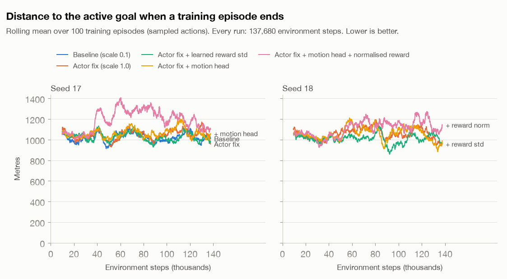
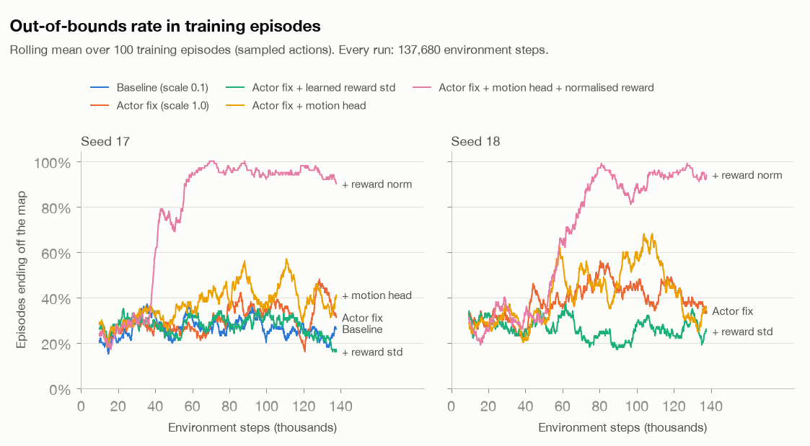

# CT-WM actor ablation: `imagination_scale` 0.1 → 1.0 (2026-09-28)

Follow-up to [`../2026-09-28_first_run_mac/`](../2026-09-28_first_run_mac/README.md). In that 1-hour run the
CT-WM world model learned, but the actor stayed a random policy for all 1,540 policy episodes.

## Hypothesis and pre-registered criteria

_Written at 02:21 CDT, after launch and before any result beyond the step-0 evaluation was available._

**Hypothesis.** The CT-WM actor loss is DreamerV2's actor loss without its 5× behaviour-cloning term:

```
loss = −imagination_scale · (REINFORCE + 0.1 · dynamics) − (0.03 · H_discrete + 0.02 · H_parameter)
```

- With `imagination_scale = 0.1`, the RL term is 10× down-weighted relative to the entropy bonus.
- Adam's update direction depends on the relative weights, not on the overall loss scale. So the entropy bonus
  (a push toward randomness) may dominate, and the actor never leaves the random policy.
- Setting `imagination_scale = 1.0` restores the RL term's weight. **This is the only change.**

**Setup.**

- The unmodified `train_nrsm_online.py`, with every default kept (compact NRSM, no demonstrations, latent-input
  actor, batch 2, H = 15, train every 5 steps, and so on).
- `run_ablation.py` (in this folder) only replaces the default `ACConfig`. The trainer's own `manifest.json`
  confirms `imagination_scale = 1.0` with all other actor-critic settings at their defaults.
- **Budget:** exactly 137,680 environment steps (`--steps`), which is what the baseline run reached. Learning
  happens per environment step, so wall-clock speed does not affect it.
- **Seed 17** is paired with the baseline. It has the same initial weights (its step-0 evaluation is identical:
  0% / 5% / 70% / 30%), the same random prefill and the same training-scene sequence.
- **Seed 18** is a replicate of the fix. There is **no seed-18 baseline**, which is a known gap.
- Evaluation is unchanged: 20 fixed scenes (70000–70019) every ~5 min, then 20 fixed + 50 fresh scenes
  (71000–71049) at the end.

**Criteria**, judged on the last quarter of policy episodes against the baseline's last quarter (1,024 m final
distance, 2.1% pickups, MOVE share 0.50):

- **The actor learns (H1)** if, in the fix runs, the mean distance to the active goal at the end of an episode is
  at least 20% lower (< 820 m) **or** the training pickup rate is at least 10%.
- **No effect (H0)** if the behaviour statistics stay at random-prefill levels: MOVE share ≈ 0.5, |parameter| ≈ 0.5,
  final distance ≈ 1,000 m, pickups ≈ 1–2%.
- **Secondary:** delivery and pickup in the deterministic evaluations, and world-model prediction error (the same
  sweep as the first report).

## Second experiment: learned-variance reward head (pre-registered)

_Written at 02:37 CDT, while the actor-fix runs were at ~23k of 137,680 steps. Only their 5-minute evaluations
(all 0% delivery) had been seen._

**Motivation (measured on the baseline's final checkpoint, `baseline_reward_signal.json`).** On ordinary
(non-terminal) steps, the goal_safe_v1 reward is −0.01 plus potential shaping. Its informative variation is tiny:
std 0.0015 on the agent's own flights. The world model's reward predictions are much worse than that:

| Data | Actual std | Prediction RMSE | Correlation with actual |
|---|---:|---:|---:|
| Agent's last 100 training episodes | 0.0015 | 0.012 (8× the std) | +0.05 to +0.07 |
| Held-out random flights | 0.0017 | 0.008–0.009 | +0.33 |
| Held-out controller flights | 0.0028 | 0.016 | −0.21 to −0.23 |

So imagination gives the actor almost no information about which steps are better. The reward head is a
**fixed unit-variance Gaussian** (`models.DenseHead`, `Normal(x, 1)`), and it has to fit both these ~0.001-scale
differences and the rare ±1 terminal rewards.

**Hypothesis.** A reward head that predicts its own per-state standard deviation can be precise on ordinary steps
and uncertain on terminal steps. That should raise the informativeness of imagined rewards and give the actor a
usable signal.

**Change.** `ablation_patches.LearnedStdHead`, with `std = 0.01 + softplus(raw)`, is the only change. It is
applied *on top of the actor fix* (`imagination_scale = 1.0`) and compared seed-for-seed with the actor-fix runs.

- Everything else is identical: the task and reward (goal_safe_v1, shaping 1.0), the loss (still the reward NLL),
  budget 137,680 steps, seeds 17 and 18.
- The team's manifest does not record this change. `<run>.ablation.json` does.

**Criteria**, compared with the actor-fix run of the same seed:

- **Mechanism (primary for this change):** on the agent's own last 100 episodes, the correlation between predicted
  and actual non-terminal rewards is **≥ 0.3**, and RMSE / std is **≤ 3** (the fixed head gives 0.05–0.07 and ~8).
- **Behaviour:** the same thresholds as the first experiment, on the last quarter of policy episodes: final
  distance < 820 m **or** pickups ≥ 10%. Also better than the actor-fix run of the same seed on both measures.
- **Guardrail:** the world model's 15-step open-loop vector RMSE is not more than 10% worse than the actor-fix run's.

## Results: experiment 1, actor fix (`imagination_scale = 1.0`)

Both runs completed exactly 137,680 environment steps (27,330 / 27,336 actor-critic updates, ~82 min each while
sharing the CPU), and checkpoint restore was verified.

**Verdict against the pre-registered criteria: H1 is not met, so H0 holds.** The actor fix alone does not make
the actor learn.

Policy (training) episodes, by quarter. The baseline is the first report's run.

| Run | Quarter | MOVE share | Mean MOVE param | Mean speed | Final distance to active goal | Pickup | Delivery | Out of bounds |
|---|---|---:|---:|---:|---:|---:|---:|---:|
| Baseline, seed 17 | Q4 | 0.50 | +0.01 | 6.7 m/step | 1,024 m | 2.1% | 0% | 24% |
| Actor fix, seed 17 | Q1 → Q4 | 0.49 → 0.51 | +0.02 | 7.2 → 7.1 m/step | 1,046 → **1,054 m** | 1.3 → **2.3%** | 0–0.3% | 26 → 33% |
| Actor fix, seed 18 | Q1 → Q4 | 0.50 → 0.50 | +0.03 → +0.02 | 7.3 → 6.8 m/step | 1,028 → **1,044 m** | 1.0 → **1.2%** | 0% | 29 → 39% |

The thresholds were < 820 m final distance or ≥ 10% pickups. Neither run comes close; both stay at the random
prefill's level (~1,150 m, 0–2% pickups).

**The change did take effect.**

- The actor's gradient-norm median rose from 0.012 (baseline) to 0.034 / 0.037.
- But the extra push produced no progress toward the goal. It came with *more* out-of-bounds endings (24% → 33% /
  39% in the last quarter).
- Deterministic evaluation: 0% delivery at every one of the 18 fixed-scene checkpoints in both seeds. Pickups peaked
  at 10% / 20% at single checkpoints, and the final fixed and fresh scenes show 0% pickup. Over 3,237 training
  episodes there was one delivery (seed 17).

**Why: the signal it amplifies is not informative** (`reward_signal_check.py`, final checkpoints):

| Run | Own flights: RMSE / actual std | Own flights: correlation | Controller flights: correlation |
|---|---:|---:|---:|
| Baseline, seed 17 | 8.1× | +0.07 | −0.23 |
| Actor fix, seed 17 | 8.1× | +0.25 | −0.34 |
| Actor fix, seed 18 | 37.6× | +0.06 | −0.19 |

On ordinary steps, the world model still cannot tell better moves from worse ones. On goal-directed flights its
predictions point the wrong way.

- Seed 18, with the most −1 out-of-bounds endings in its replay, has the largest errors. That fits the
  "one fixed-width head is pulled by rare ±1 rewards" diagnosis.
- Its state predictions are unaffected by the actor change: the 15-step open-loop RMSE at the end is 0.441 / 0.403,
  against 0.444 for the baseline and 0.448 for persistence.

**Conclusion.** Down-weighting of the RL term is not the only reason the actor fails. Weighting it up does not
help, because imagined rewards carry almost no usable signal. This makes experiment 2, which targets the reward
head, the critical test.

## Results: experiment 2, actor fix + learned reward std

Both runs completed exactly 137,680 steps (~85 min each), and checkpoint restore was verified.

**Verdict against the pre-registered criteria: all three fail.**

| Run | Own flights: correlation (≥ 0.3?) | RMSE / std (≤ 3?) | Final distance, Q4 (< 820 m?) | Pickups, Q4 (≥ 10%?) | 15-step open-loop RMSE (guardrail: ≤ 1.1× actor fix) |
|---|---:|---:|---:|---:|---:|
| Actor fix, seed 17 | +0.25 | 8.1× | 1,054 m | 2.3% | 0.441 |
| **+ learned reward std, seed 17** | **+0.08** ✗ | **9.9×** ✗ | **1,012 m** ✗ | **1.8%** ✗ | **0.563** ✗ (+28%) |
| Actor fix, seed 18 | +0.06 | 37.6× | 1,044 m | 1.2% | 0.403 |
| **+ learned reward std, seed 18** | **−0.02** ✗ | **9.5×** ✗ | **1,019 m** ✗ | **1.8%** ✗ | **0.662** ✗ (+64%) |

Deterministic evaluation: 0% delivery at every checkpoint of both seeds. Final fixed / fresh pickups were 0% / 2%
(seed 17) and 5% / 0% (seed 18).

**What happened** (training logs):

- The head became confident: the reward NLL fell from +0.75 to −3.3, which means its predicted std sat at the 0.01
  floor. Its errors on ordinary steps did not shrink (RMSE ≈ 0.009–0.015).
- A confident head with unchanged errors produces large gradients. The world-model gradient norm had a median of
  **174 after the first 1,000 updates, against 23 in the baseline**. Almost every update was therefore clipped
  to 100.
- Under global-norm clipping, the reward term then dominates each update. The state predictions degrade (1-step
  open-loop RMSE 0.43 / 0.65, against 0.23 / 0.20 for the actor fix), and the policy still does not improve.

**Root cause: the world model cannot see the effect of a single step.** A per-dimension check on the 8 held-out
episodes:

| Final checkpoint | 1-step prior position error (median) | Active-goal offset error (median) |
|---|---:|---:|
| Baseline, seed 17 | 221 m | 206 m |
| Actor fix, seed 18 | 211 m | 213 m |
| Actual movement per step in those flights | 22 m (max 40 m) | n/a |

- The per-step shaping reward depends on how much one step (≤ 40 m) changes the remaining route. The model's
  position estimate is uncertain by ~10× that, so no reward head, whether fixed or learned-width, can recover the
  signal from these features.
- The team's DreamerV2 diagnosis shows the same pattern: 1-step position error of 273–294 m, against 15–17 m for
  persistence (`STAGE1_RESULTS_20260910.md` §4). This looks like a shared world-model bottleneck, not something
  specific to CTM.

## Third experiment: one-step motion head (pre-registered)

_Written at 15:05 CDT, before launch._

**Motivation (experiments 1–2).** The world model's 1-step position error is ~210–230 m, but the drone moves ~22 m
per step. So the latent state cannot resolve what a single action changes, and neither can any reward head built on
it. The absolute-vector loss (unit-variance Gaussian on the normalised vector) barely distinguishes 20 m from 200 m.

**Change.** `ablation_patches` gains a `delta_weight` option (`--delta-head 1.0`). This is the only change.

- An auxiliary head predicts the one-step change of x, y, speed and sin/cos heading from the same posterior
  features as the other heads.
- Targets are divided by fixed per-dimension scales: the std of one-step changes in the baseline's 12
  random-prefill episodes, which is 7.5 m for x and 7.3 m for y. The targets are clipped at ±10.
- The loss becomes the team's unchanged world-model loss plus 1.0 × the head's unit-variance NLL. Absolute
  reconstruction and all other heads stay as they are.
- Phase and goal offsets are excluded, because they jump at pickup. Elapsed time is excluded because it is constant.
- Why this should help: the latent state must now encode motion at metre scale, which is the information per-step
  rewards depend on.
- The change is applied on top of the actor fix and compared seed-for-seed with the actor-fix runs (seeds 17 and
  18, 137,680 steps).
- **Relaunch note.** Times are from git and file timestamps.
  - This protocol was committed at 15:06:07 (`228d35d`).
  - A first launch (~15:06) was stopped at ~15:07 after ~2,080 steps, before any analysis. Its outputs were deleted,
    and nothing from it was used.
  - The fix was committed at 15:08:37 (`ff40afa`), and the runs were relaunched at 15:08.
  - Cause: the new head drew its initial weights from TensorFlow's shared random stream, which shifted every other
    initial weight. Seed 17's step-0 evaluation was 0 / 0 / 100 / 0% instead of the paired runs' 0 / 5 / 70 / 30%.
  - Fix: the head (`MotionHead`) now uses fixed-seed initialisers. All other initial weights (world model, actor,
    critic) are then bit-identical to the actor-fix configuration (verified), and seed 17's step-0 evaluation
    matches exactly.

**Criteria**, compared with the actor-fix run of the same seed:

- **Mechanism A (primary):** on the 8 held-out episodes, the median error of the motion head's 1-step
  position-change prediction from *prior* features is **≤ 11 m**, half the median step. The report also gives a
  constant-velocity baseline.
- **Mechanism B:** on the agent's own last 100 episodes, reward-prediction correlation on non-terminal steps is
  **≥ 0.3**, with RMSE / std ≤ 3.
- **Behaviour:** in the last quarter of policy episodes, final distance < 820 m **or** pickups ≥ 10%. It must also
  be better than the actor fix of the same seed on both measures.
- **Guardrails:**
  - The 15-step open-loop vector RMSE is ≤ 1.1× the actor fix's.
  - The median world-model gradient norm after 1,000 updates is ≤ 70 (about 3× the baseline's 23). Experiment 2
    failed through clipping domination, and this guardrail catches that.

## Results: experiment 3, actor fix + one-step motion head

Both runs completed exactly 137,680 steps (27,330 / 27,336 actor-critic updates, ~71 min each), and checkpoint
restore was verified.

**Verdict against the pre-registered criteria:**

| Criterion | Seed 17 | Seed 18 | Verdict |
|---|---:|---:|---|
| **A (primary):** motion-head 1-step position-change error, held-out median ≤ 11 m | **2.6 m** | **2.3 m** | ✅ Pass |
| **B:** own-flight reward correlation ≥ 0.3 **and** RMSE / std ≤ 3 | +0.32, 12.5× | +0.17, 19.0× | ❌ Fail |
| **Behaviour:** Q4 final distance < 820 m or pickups ≥ 10%, and better than the actor fix | 1,077 m, 1.7% | 1,043 m, 1.9% | ❌ Fail |
| **Guardrail:** 15-step open-loop RMSE ≤ 1.1× the actor fix (0.441 / 0.403) | 0.435 | 0.409 | ✅ Pass |
| **Guardrail:** median world-model gradient norm after 1,000 updates ≤ 70 | 25.5 | 30.5 | ✅ Pass |

**The motion head does its job.** One-step position-change error in metres (`delta_check.py`, same steps for every
method):

| Run | Held-out: absolute decoder | Held-out: motion head | Own flights: absolute decoder | Own flights: motion head |
|---|---:|---:|---:|---:|
| Actor fix, seed 17 / 18 | 218 / 208 m | n/a | 190 / 163 m | n/a |
| + motion head, seed 17 / 18 | 229 / 222 m | **2.6 / 2.3 m** | 203 / 190 m | **1.2 / 1.2 m** |
| Constant velocity (repeat the last step's movement) | 1.7 m | 1.7 m | 1.5–1.9 m | 1.5–1.9 m |
| Median actual step | 22 m | 22 m | 4–5 m | 4–5 m |

- The latent state now encodes metre-scale motion.
- On the agent's own flights the motion head beats the constant-velocity guess, so it captures what each action
  changes. On the faster held-out flights it is within 1 m of that guess.
- The absolute decoder is unchanged (~200 m). The pre-registered 11 m bar turned out to be loose next to the 1.7 m
  constant-velocity guess; that guess was measured after launch, and the bar was not changed.
- The motion-head loss fell from 7.0 / 9.4 to 4.8 / 4.7. The world model's other predictions were not harmed (both
  guardrails pass).

**But the reward signal improves only modestly, and the actor still does not learn.**

- Own-flight reward correlation rose from +0.25 / +0.06 (actor fix) to +0.32 / +0.17. The RMSE is still 12–19× the
  real reward variation.
- Deterministic evaluation: 0% delivery at all 16 fixed-scene checkpoints of both seeds; pickups ≤ 10%.
- In the last quarter, the policy flies slightly faster (7.4 / 7.5 against 7.1 / 6.8 m/step) and leaves the map more
  often (42% against 33% / 39%), but does not approach the goals.
- Final evaluations show the same shift: fewer timeouts, more out-of-bounds endings (38–54%).

**Interpretation.** The information needed for per-step rewards is now in the latent state, but the reward head
does not use it.

- A plausible reason is the one diagnosed in experiment 2: the reward head is a unit-variance Gaussian, and rewards
  that vary by ~0.0015 give it almost no gradient.
- The agent's own flights move only ~4–5 m per step, so their shaping rewards are even smaller than on held-out
  flights.
- The natural next step applies the recipe that worked here to the reward. For example, add an auxiliary head for
  the per-step reward with a fixed-scale normalised target, which avoids experiment 2's learned-variance clipping
  failure. Or compute the imagined shaping from the motion head's predicted displacement, projected onto the goal
  direction.

## Fourth experiment: normalised reward head (pre-registered)

_Written at 17:03 CDT, before launch._

**Motivation (experiment 3).** With the motion head, the latent state resolves single steps to ~1–3 m. But the
reward head still predicts per-step rewards badly on the agent's own flights: correlation +0.32 / +0.17, RMSE
12.5× / 19.0× the reward std. Its target is the raw reward under a unit-variance Gaussian. Non-terminal rewards
vary by only ~0.0014, so they give it almost no gradient.

**Change.** `ablation_patches` gains a `reward_norm` option (`--normalised-reward`). This is the only change.

- The reward network is kept as it is: same layers, same initial weights.
- Its target becomes `symlog((r − μ) / σ)`, under a unit-variance NLL. μ = −0.007229 and σ = 0.001387 are the
  mean and std of the 1,018 non-terminal rewards in the same 12 prefill episodes that gave the motion scales.
- Ordinary steps map to |target| ≤ ~1.6. Symlog keeps the rare ±1 terminal rewards representable (~±6.6) without
  them dominating the loss (unsquashed they would be ~±700). This avoids experiment 2's learned-variance failure.
- `mean()` returns rewards in the original units, so the team's world loss and actor objective run unchanged.
- The change is applied on top of the actor fix and the motion head, and compared seed-for-seed with experiment 3
  (seeds 17 and 18, 137,680 steps).
- Pairing is verified: all initial weights are bit-identical to experiment 3, and a short run's seed-17 step-0
  evaluation reproduces 0 / 5 / 70 / 30%.

**Criteria**, compared with experiment 3 on the same seed:

- **Mechanism (primary):** on the agent's own last 100 episodes, reward-prediction correlation on non-terminal
  steps is **≥ 0.3**, with RMSE / std **≤ 3** (experiment 3: +0.32 / +0.17, 12.5× / 19.0×).
- **Behaviour:** in the last quarter of policy episodes, final distance < 820 m **or** pickups ≥ 10%. It must also
  be better than experiment 3 on the same seed on both. Deterministic delivery is reported as well.
- **Guardrails:**
  - The 15-step open-loop vector RMSE is ≤ 1.1× experiment 3's (0.435 / 0.409).
  - The motion head's held-out 1-step error stays ≤ 11 m.
  - The median world-model gradient norm after 1,000 updates is ≤ 70.

## Results: experiment 4, actor fix + motion head + normalised reward head

Both runs completed exactly 137,680 steps (~75 min each), and checkpoint restore was verified. Their step-0
evaluations reproduced experiment 3 exactly.

**Verdict against the pre-registered criteria:**

| Criterion | Seed 17 | Seed 18 | Verdict |
|---|---:|---:|---|
| **Mechanism (primary):** own-flight reward correlation ≥ 0.3 and RMSE / std ≤ 3 (exp 3: +0.32 / +0.17, 12.5× / 19.0×) | **+0.75, 1.0×** | **+0.78, 0.8×** | ✅ Pass |
| **Behaviour:** Q4 final distance < 820 m or pickups ≥ 10%, and better than exp 3 | 1,156 m, 2.9% | 1,161 m, 5.6% | ❌ Fail |
| **Guardrail:** 15-step open-loop RMSE ≤ 1.1× exp 3 (0.435 / 0.409) | 0.382 | 0.441 (+8%) | ✅ Pass |
| **Guardrail:** motion head ≤ 11 m; median world-model gradient ≤ 70 | 2.7 m, 25.3 | 2.2 m, 30.8 | ✅ Pass |

**The reward head now predicts ordinary steps well. For the first time, the actor clearly responds to what it
imagines, but in the wrong direction.**

| Last quarter of policy episodes | Exp 3, seed 17 | Exp 4, seed 17 | Exp 3, seed 18 | Exp 4, seed 18 |
|---|---:|---:|---:|---:|
| Mean speed | 7.4 m/step | **12.3 m/step** | 7.5 m/step | **12.6 m/step** |
| Out of bounds | 42% | **94%** | 42% | **94%** |
| Mean episode length | 81 | **52** | 79 | **48** |
| Final distance to active goal | 1,077 m | 1,156 m | 1,043 m | 1,161 m |
| Pickups | 1.7% | 2.9% | 1.9% | 5.6% |

Deterministic evaluation also shows 0% delivery, but 90–100% out-of-bounds endings after ~34–43 steps.

**Why (`terminal_reward_check.py`, the agent's own last 100 episodes, one-step prior predictions):**

| Reward on… | Actual | Exp 3 prediction (raw target) | Exp 4 prediction (symlog target) |
|---|---:|---:|---:|
| Episode-ending steps (mostly out of bounds) | −0.68 | −0.41 / −0.29 | **−0.022 / −0.014** |
| The step just before | −0.009 | −0.023 / −0.030 | −0.011 / −0.011 |
| All other steps | −0.007 | −0.009 / −0.023 | −0.007 / −0.008 |

- The normalised head gets ordinary steps right, but predicts **almost no penalty for ending the episode**.
- The cause is that a single Gaussian in symlog space averages the rare terminal outcome (target ≈ −6.2) with
  ordinary ones (≈ 0). Mapped back with symexp, which is exponential, the in-between value becomes a tiny penalty.
  The raw-scale head of experiment 3 also under-predicted the penalty, but it averaged in linear space, which keeps
  the expected value.
- So in imagination, flying off the map looks nearly free, while continuing costs about −0.007 per step plus a
  poor future. The actor learned to leave quickly.
- This is model exploitation of a biased reward prediction. It is also the first evidence in these runs that the
  CT-WM actor-critic *does* learn from imagined rewards once they carry a signal.

**Next step (not run).** Keep the normalised treatment of ordinary steps, but represent the reward as a
distribution whose mean is taken in the original units.

- DreamerV3's *two-hot* symlog bins do this: the expected reward is Σ p_i · symexp(bin_i), so rare large penalties
  keep their full weight.
- An alternative is to split the reward: the normalised head on non-terminal steps, a separate raw-scale head for
  terminal steps, weighted by the predicted termination probability.

## Figures

One panel per seed. Colour follows the condition: blue = baseline, orange = actor fix, aqua = actor fix + learned
reward std, yellow = actor fix + motion head, pink = actor fix + motion head + normalised reward. Seed 18 has no
baseline run.

<picture>
  <source media="(prefers-color-scheme: dark)" srcset="final_distance_to_goal_dark.png">
  
</picture>

<picture>
  <source media="(prefers-color-scheme: dark)" srcset="training_pickup_rate_dark.png">
  
</picture>

<picture>
  <source media="(prefers-color-scheme: dark)" srcset="training_oob_rate_dark.png">
  
</picture>

<picture>
  <source media="(prefers-color-scheme: dark)" srcset="world_model_15step_dark.png">
  
</picture>

<picture>
  <source media="(prefers-color-scheme: dark)" srcset="actor_gradient_norm_dark.png">
  
</picture>

## Overall conclusions

1. **No change so far makes the CT-WM actor deliver within 137,680 steps.** All nine runs end at 0% delivery:
   baseline, 2 × actor fix, 2 × + reward std, 2 × + motion head, 2 × + normalised reward.
2. **The imagination-scale hypothesis is rejected as the sole cause.** Up-weighting the RL term increases actor
   gradients ~3× but amplifies an uninformative signal (with slightly more out-of-bounds endings).
3. **The learned reward-std head, in this form, is rejected and harmful.** It does not improve reward prediction,
   and it degrades the world model through gradient clipping. If it is retried, the reward term needs its own
   weighting or a separate clip, or a larger `min_std`.
4. **Single-step precision was a real bottleneck, and it is fixable.**
   - A normalised one-step motion head brings the latent's motion error from ~200 m to ~1–3 m, better than a
     constant-velocity guess on the agent's own flights, without harming the rest of the world model.
5. **Normalising the reward target fixes ordinary-step reward prediction.**
   - With the motion head in place, a symlog-normalised reward target lifts own-flight correlation from +0.17–0.32
     to **+0.75–0.78**, with RMSE ≈ the real variation.
6. **Once imagined rewards carry a signal, the actor does learn from them, but it exploits a biased terminal
   prediction.**
   - A Gaussian mean in symlog space predicts almost no penalty for ending the episode (−0.02 instead of −0.68).
   - The actor therefore learns to fly off the map quickly: 94% out of bounds, at almost twice the speed.
   - The terminal outcome has to be represented so that its expected value survives.

**Suggested next experiments** (not run; one variable each, on top of actor fix + motion head):

- **A two-hot symlog reward head (DreamerV3).** A categorical distribution over symlog bins, with the expected
  reward taken in original units (Σ p_i · symexp(bin_i)). This keeps both the ordinary-step precision of
  experiment 4 and the full weight of rare terminal penalties.
- **A split reward.** The normalised head on non-terminal steps, plus a raw-scale head for terminal steps,
  combined with the predicted termination probability.
- **Analytic shaping in imagination.** Compute γΦ(s′) − Φ(s) from the motion head's predicted displacement,
  projected onto the goal direction.
- Any positive result needs ≥ 3 seeds per condition. Seed 18 in these experiments has no baseline control.

## Files in this folder

| File | Content |
|---|---|
| `run_ablation.py`, `ablation_patches.py` | Wrapper and runtime patches (the team's code is not modified) |
| `*_ablation.json` | Per-run record of the changes and the wrapper/patch SHA-256 |
| `imagscale1_seed{17,18}_*`, `imagscale1_rewardstd_seed{17,18}_*`, `imagscale1_delta_seed{17,18}_*`, `imagscale1_delta_rewardnorm_seed{17,18}_*` | Per-run evaluations, training log, episodes, action stats, world-model sweep, reward check, motion check, terminal-reward check (experiments 3–4), `result.json`, `manifest.json` |
| `baseline_reward_signal.json`, `baseline_delta_check.json` | Reward and motion checks on the first report's final checkpoint |
| `sweep_world_model.py`, `reward_signal_check.py`, `delta_check.py`, `terminal_reward_check.py`, `make_figures.py` | Analysis scripts (reproduce the files and figures) |
| `*_light.png`, `*_dark.png` | Comparison figures |

The git history records which script revision each set of runs used:

- actor-fix runs: wrapper `82ec9cd`;
- reward-fix runs: wrapper and patches `4f09dfd`;
- motion-head runs: wrapper `228d35d`, patches `ff40afa`;
- normalised-reward runs: wrapper and patches `f032152`.
