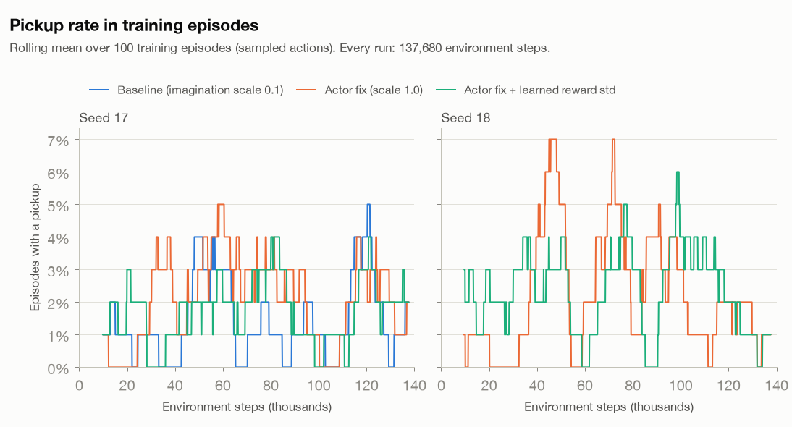
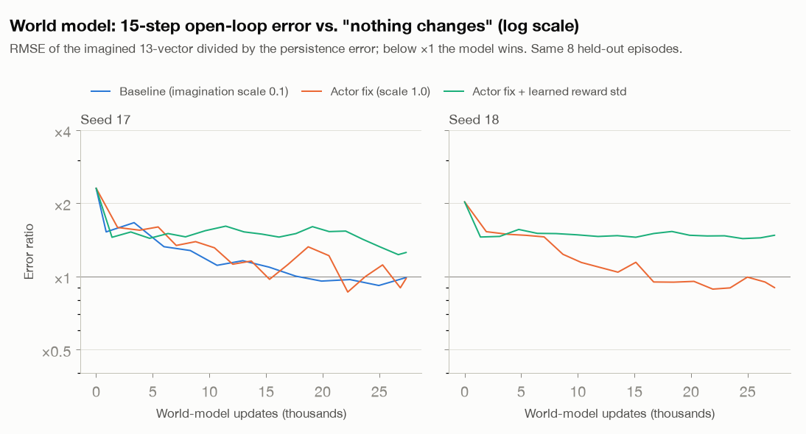
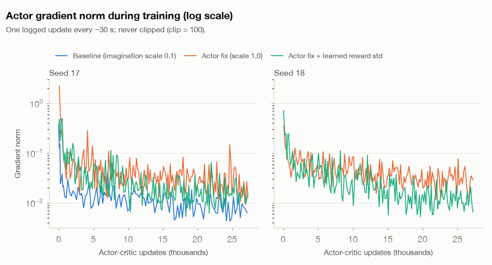

# CT-WM actor ablation: `imagination_scale` 0.1 → 1.0 (2026-09-28)

Follow-up to [`../2026-09-28_first_run_mac/`](../2026-09-28_first_run_mac/README.md). In that 1-hour run the
CT-WM world model learned, but the actor stayed a random policy for all 1,540 policy episodes.

## Hypothesis and pre-registered criteria

_Written at 02:21 CDT, after launch and before any result beyond the step-0 evaluation was available._

**Hypothesis.** The CT-WM actor loss is DreamerV2's actor loss without its 5× behaviour-cloning term:

```
loss = −imagination_scale · (REINFORCE + 0.1 · dynamics) − (0.03 · H_discrete + 0.02 · H_parameter)
```

- With `imagination_scale = 0.1`, the RL term is 10× down-weighted relative to the entropy bonus.
- Adam's update direction depends on the relative weights, not on the overall loss scale. So the entropy bonus
  (a push toward randomness) may dominate, and the actor never leaves the random policy.
- Setting `imagination_scale = 1.0` restores the RL term's weight. **This is the only change.**

**Setup.**

- The unmodified `train_nrsm_online.py`, with every default kept (compact NRSM, no demonstrations, latent-input
  actor, batch 2, H = 15, train every 5 steps, and so on).
- `run_ablation.py` (in this folder) only replaces the default `ACConfig`. The trainer's own `manifest.json`
  confirms `imagination_scale = 1.0` with all other actor-critic settings at their defaults.
- **Budget:** exactly 137,680 environment steps (`--steps`), which is what the baseline run reached. Learning
  happens per environment step, so wall-clock speed does not affect it.
- **Seed 17** is paired with the baseline. It has the same initial weights (its step-0 evaluation is identical:
  0% / 5% / 70% / 30%), the same random prefill and the same training-scene sequence.
- **Seed 18** is a replicate of the fix. There is **no seed-18 baseline**, which is a known gap.
- Evaluation is unchanged: 20 fixed scenes (70000–70019) every ~5 min, then 20 fixed + 50 fresh scenes
  (71000–71049) at the end.

**Criteria**, judged on the last quarter of policy episodes against the baseline's last quarter (1,024 m final
distance, 2.1% pickups, MOVE share 0.50):

- **The actor learns (H1)** if, in the fix runs, the mean distance to the active goal at the end of an episode is
  at least 20% lower (< 820 m) **or** the training pickup rate is at least 10%.
- **No effect (H0)** if the behaviour statistics stay at random-prefill levels: MOVE share ≈ 0.5, |parameter| ≈ 0.5,
  final distance ≈ 1,000 m, pickups ≈ 1–2%.
- **Secondary:** delivery and pickup in the deterministic evaluations, and world-model prediction error (the same
  sweep as the first report).

## Second experiment: learned-variance reward head (pre-registered)

_Written at 02:37 CDT, while the actor-fix runs were at ~23k of 137,680 steps. Only their 5-minute evaluations
(all 0% delivery) had been seen._

**Motivation (measured on the baseline's final checkpoint, `baseline_reward_signal.json`).** On ordinary
(non-terminal) steps, the goal_safe_v1 reward is −0.01 plus potential shaping. Its informative variation is tiny:
std 0.0015 on the agent's own flights. The world model's reward predictions are much worse than that:

| Data | Actual std | Prediction RMSE | Correlation with actual |
|---|---:|---:|---:|
| Agent's last 100 training episodes | 0.0015 | 0.012 (8× the std) | +0.05 to +0.07 |
| Held-out random flights | 0.0017 | 0.008–0.009 | +0.33 |
| Held-out controller flights | 0.0028 | 0.016 | −0.21 to −0.23 |

So imagination gives the actor almost no information about which steps are better. The reward head is a
**fixed unit-variance Gaussian** (`models.DenseHead`, `Normal(x, 1)`), and it has to fit both these ~0.001-scale
differences and the rare ±1 terminal rewards.

**Hypothesis.** A reward head that predicts its own per-state standard deviation can be precise on ordinary steps
and uncertain on terminal steps. That should raise the informativeness of imagined rewards and give the actor a
usable signal.

**Change.** `ablation_patches.LearnedStdHead`, with `std = 0.01 + softplus(raw)`, is the only change. It is
applied *on top of the actor fix* (`imagination_scale = 1.0`) and compared seed-for-seed with the actor-fix runs.

- Everything else is identical: the task and reward (goal_safe_v1, shaping 1.0), the loss (still the reward NLL),
  budget 137,680 steps, seeds 17 and 18.
- The team's manifest does not record this change. `<run>.ablation.json` does.

**Criteria**, compared with the actor-fix run of the same seed:

- **Mechanism (primary for this change):** on the agent's own last 100 episodes, the correlation between predicted
  and actual non-terminal rewards is **≥ 0.3**, and RMSE / std is **≤ 3** (the fixed head gives 0.05–0.07 and ~8).
- **Behaviour:** the same thresholds as the first experiment, on the last quarter of policy episodes: final
  distance < 820 m **or** pickups ≥ 10%. Also better than the actor-fix run of the same seed on both measures.
- **Guardrail:** the world model's 15-step open-loop vector RMSE is not more than 10% worse than the actor-fix run's.

## Results: experiment 1, actor fix (`imagination_scale = 1.0`)

Both runs completed exactly 137,680 environment steps (27,330 / 27,336 actor-critic updates, ~82 min each while
sharing the CPU), and checkpoint restore was verified.

**Verdict against the pre-registered criteria: H1 is not met, so H0 holds.** The actor fix alone does not make
the actor learn.

Policy (training) episodes, by quarter. The baseline is the first report's run.

| Run | Quarter | MOVE share | Mean MOVE param | Mean speed | Final distance to active goal | Pickup | Delivery | Out of bounds |
|---|---|---:|---:|---:|---:|---:|---:|---:|
| Baseline, seed 17 | Q4 | 0.50 | +0.01 | 6.7 m/step | 1,024 m | 2.1% | 0% | 24% |
| Actor fix, seed 17 | Q1 → Q4 | 0.49 → 0.51 | +0.02 | 7.2 → 7.1 m/step | 1,046 → **1,054 m** | 1.3 → **2.3%** | 0–0.3% | 26 → 33% |
| Actor fix, seed 18 | Q1 → Q4 | 0.50 → 0.50 | +0.03 → +0.02 | 7.3 → 6.8 m/step | 1,028 → **1,044 m** | 1.0 → **1.2%** | 0% | 29 → 39% |

The thresholds were < 820 m final distance or ≥ 10% pickups. Neither run comes close; both stay at the random
prefill's level (~1,150 m, 0–2% pickups).

**The change did take effect.**

- The actor's gradient-norm median rose from 0.012 (baseline) to 0.034 / 0.037.
- But the extra push produced no progress toward the goal. It came with *more* out-of-bounds endings (24% → 33% /
  39% in the last quarter).
- Deterministic evaluation: 0% delivery at every one of the 18 fixed-scene checkpoints in both seeds. Pickups peaked
  at 10% / 20% at single checkpoints, and the final fixed and fresh scenes show 0% pickup. Over 3,237 training
  episodes there was one delivery (seed 17).

**Why: the signal it amplifies is not informative** (`reward_signal_check.py`, final checkpoints):

| Run | Own flights: RMSE / actual std | Own flights: correlation | Controller flights: correlation |
|---|---:|---:|---:|
| Baseline, seed 17 | 8.1× | +0.07 | −0.23 |
| Actor fix, seed 17 | 8.1× | +0.25 | −0.34 |
| Actor fix, seed 18 | 37.6× | +0.06 | −0.19 |

On ordinary steps, the world model still cannot tell better moves from worse ones. On goal-directed flights its
predictions point the wrong way.

- Seed 18, with the most −1 out-of-bounds endings in its replay, has the largest errors. That fits the
  "one fixed-width head is pulled by rare ±1 rewards" diagnosis.
- Its state predictions are unaffected by the actor change: the 15-step open-loop RMSE at the end is 0.441 / 0.403,
  against 0.444 for the baseline and 0.448 for persistence.

**Conclusion.** Down-weighting of the RL term is not the only reason the actor fails. Weighting it up does not
help, because imagined rewards carry almost no usable signal. This makes experiment 2, which targets the reward
head, the critical test.

## Results: experiment 2, actor fix + learned reward std

Both runs completed exactly 137,680 steps (~85 min each), and checkpoint restore was verified.

**Verdict against the pre-registered criteria: all three fail.**

| Run | Own flights: correlation (≥ 0.3?) | RMSE / std (≤ 3?) | Final distance, Q4 (< 820 m?) | Pickups, Q4 (≥ 10%?) | 15-step open-loop RMSE (guardrail: ≤ 1.1× actor fix) |
|---|---:|---:|---:|---:|---:|
| Actor fix, seed 17 | +0.25 | 8.1× | 1,054 m | 2.3% | 0.441 |
| **+ learned reward std, seed 17** | **+0.08** ✗ | **9.9×** ✗ | **1,012 m** ✗ | **1.8%** ✗ | **0.563** ✗ (+28%) |
| Actor fix, seed 18 | +0.06 | 37.6× | 1,044 m | 1.2% | 0.403 |
| **+ learned reward std, seed 18** | **−0.02** ✗ | **9.5×** ✗ | **1,019 m** ✗ | **1.8%** ✗ | **0.662** ✗ (+64%) |

Deterministic evaluation: 0% delivery at every checkpoint of both seeds. Final fixed / fresh pickups were 0% / 2%
(seed 17) and 5% / 0% (seed 18).

**What happened** (training logs):

- The head became confident: the reward NLL fell from +0.75 to −3.3, which means its predicted std sat at the 0.01
  floor. Its errors on ordinary steps did not shrink (RMSE ≈ 0.009–0.015).
- A confident head with unchanged errors produces large gradients. The world-model gradient norm had a median of
  **174 after the first 1,000 updates, against 23 in the baseline**. Almost every update was therefore clipped
  to 100.
- Under global-norm clipping, the reward term then dominates each update. The state predictions degrade (1-step
  open-loop RMSE 0.43 / 0.65, against 0.23 / 0.20 for the actor fix), and the policy still does not improve.

**Root cause: the world model cannot see the effect of a single step.** A per-dimension check on the 8 held-out
episodes:

| Final checkpoint | 1-step prior position error (median) | Active-goal offset error (median) |
|---|---:|---:|
| Baseline, seed 17 | 221 m | 206 m |
| Actor fix, seed 18 | 211 m | 213 m |
| Actual movement per step in those flights | 22 m (max 40 m) | n/a |

- The per-step shaping reward depends on how much one step (≤ 40 m) changes the remaining route. The model's
  position estimate is uncertain by ~10× that, so no reward head, whether fixed or learned-width, can recover the
  signal from these features.
- The team's DreamerV2 diagnosis shows the same pattern: 1-step position error of 273–294 m, against 15–17 m for
  persistence (`STAGE1_RESULTS_20260910.md` §4). This looks like a shared world-model bottleneck, not something
  specific to CTM.

## Third experiment: one-step motion head (pre-registered)

_Written at 15:05 CDT, before launch._

**Motivation (experiments 1–2).** The world model's 1-step position error is ~210–230 m, but the drone moves ~22 m
per step. So the latent state cannot resolve what a single action changes, and neither can any reward head built on
it. The absolute-vector loss (unit-variance Gaussian on the normalised vector) barely distinguishes 20 m from 200 m.

**Change.** `ablation_patches` gains a `delta_weight` option (`--delta-head 1.0`). This is the only change.

- An auxiliary head predicts the one-step change of x, y, speed and sin/cos heading from the same posterior
  features as the other heads.
- Targets are divided by fixed per-dimension scales: the std of one-step changes in the baseline's 12
  random-prefill episodes, which is 7.5 m for x and 7.3 m for y. The targets are clipped at ±10.
- The loss becomes the team's unchanged world-model loss plus 1.0 × the head's unit-variance NLL. Absolute
  reconstruction and all other heads stay as they are.
- Phase and goal offsets are excluded, because they jump at pickup. Elapsed time is excluded because it is constant.
- Why this should help: the latent state must now encode motion at metre scale, which is the information per-step
  rewards depend on.
- The change is applied on top of the actor fix and compared seed-for-seed with the actor-fix runs (seeds 17 and
  18, 137,680 steps).
- **Relaunch note.** Times are from git and file timestamps.
  - This protocol was committed at 15:06:07 (`228d35d`).
  - A first launch (~15:06) was stopped at ~15:07 after ~2,080 steps, before any analysis. Its outputs were deleted,
    and nothing from it was used.
  - The fix was committed at 15:08:37 (`ff40afa`), and the runs were relaunched at 15:08.
  - Cause: the new head drew its initial weights from TensorFlow's shared random stream, which shifted every other
    initial weight. Seed 17's step-0 evaluation was 0 / 0 / 100 / 0% instead of the paired runs' 0 / 5 / 70 / 30%.
  - Fix: the head (`MotionHead`) now uses fixed-seed initialisers. All other initial weights (world model, actor,
    critic) are then bit-identical to the actor-fix configuration (verified), and seed 17's step-0 evaluation
    matches exactly.

**Criteria**, compared with the actor-fix run of the same seed:

- **Mechanism A (primary):** on the 8 held-out episodes, the median error of the motion head's 1-step
  position-change prediction from *prior* features is **≤ 11 m**, half the median step. The report also gives a
  constant-velocity baseline.
- **Mechanism B:** on the agent's own last 100 episodes, reward-prediction correlation on non-terminal steps is
  **≥ 0.3**, with RMSE / std ≤ 3.
- **Behaviour:** in the last quarter of policy episodes, final distance < 820 m **or** pickups ≥ 10%. It must also
  be better than the actor fix of the same seed on both measures.
- **Guardrails:**
  - The 15-step open-loop vector RMSE is ≤ 1.1× the actor fix's.
  - The median world-model gradient norm after 1,000 updates is ≤ 70 (about 3× the baseline's 23). Experiment 2
    failed through clipping domination, and this guardrail catches that.

## Results: experiment 3, actor fix + one-step motion head

Both runs completed exactly 137,680 steps (27,330 / 27,336 actor-critic updates, ~71 min each), and checkpoint
restore was verified.

**Verdict against the pre-registered criteria:**

| Criterion | Seed 17 | Seed 18 | Verdict |
|---|---:|---:|---|
| **A (primary):** motion-head 1-step position-change error, held-out median ≤ 11 m | **2.6 m** | **2.3 m** | ✅ Pass |
| **B:** own-flight reward correlation ≥ 0.3 **and** RMSE / std ≤ 3 | +0.32, 12.5× | +0.17, 19.0× | ❌ Fail |
| **Behaviour:** Q4 final distance < 820 m or pickups ≥ 10%, and better than the actor fix | 1,077 m, 1.7% | 1,043 m, 1.9% | ❌ Fail |
| **Guardrail:** 15-step open-loop RMSE ≤ 1.1× the actor fix (0.441 / 0.403) | 0.435 | 0.409 | ✅ Pass |
| **Guardrail:** median world-model gradient norm after 1,000 updates ≤ 70 | 25.5 | 30.5 | ✅ Pass |

**The motion head does its job.** One-step position-change error in metres (`delta_check.py`, same steps for every
method):

| Run | Held-out: absolute decoder | Held-out: motion head | Own flights: absolute decoder | Own flights: motion head |
|---|---:|---:|---:|---:|
| Actor fix, seed 17 / 18 | 218 / 208 m | n/a | 190 / 163 m | n/a |
| + motion head, seed 17 / 18 | 229 / 222 m | **2.6 / 2.3 m** | 203 / 190 m | **1.2 / 1.2 m** |
| Constant velocity (repeat the last step's movement) | 1.7 m | 1.7 m | 1.5–1.9 m | 1.5–1.9 m |
| Median actual step | 22 m | 22 m | 4–5 m | 4–5 m |

- The latent state now encodes metre-scale motion.
- On the agent's own flights the motion head beats the constant-velocity guess, so it captures what each action
  changes. On the faster held-out flights it is within 1 m of that guess.
- The absolute decoder is unchanged (~200 m). The pre-registered 11 m bar turned out to be loose next to the 1.7 m
  constant-velocity guess; that guess was measured after launch, and the bar was not changed.
- The motion-head loss fell from 7.0 / 9.4 to 4.8 / 4.7. The world model's other predictions were not harmed (both
  guardrails pass).

**But the reward signal improves only modestly, and the actor still does not learn.**

- Own-flight reward correlation rose from +0.25 / +0.06 (actor fix) to +0.32 / +0.17. The RMSE is still 12–19× the
  real reward variation.
- Deterministic evaluation: 0% delivery at all 16 fixed-scene checkpoints of both seeds; pickups ≤ 10%.
- In the last quarter, the policy flies slightly faster (7.4 / 7.5 against 7.1 / 6.8 m/step) and leaves the map more
  often (42% against 33% / 39%), but does not approach the goals.
- Final evaluations show the same shift: fewer timeouts, more out-of-bounds endings (38–54%).

**Interpretation.** The information needed for per-step rewards is now in the latent state, but the reward head
does not use it.

- A plausible reason is the one diagnosed in experiment 2: the reward head is a unit-variance Gaussian, and rewards
  that vary by ~0.0015 give it almost no gradient.
- The agent's own flights move only ~4–5 m per step, so their shaping rewards are even smaller than on held-out
  flights.
- The natural next step applies the recipe that worked here to the reward. For example, add an auxiliary head for
  the per-step reward with a fixed-scale normalised target, which avoids experiment 2's learned-variance clipping
  failure. Or compute the imagined shaping from the motion head's predicted displacement, projected onto the goal
  direction.

## Fourth experiment: normalised reward head (pre-registered)

_Written at 17:03 CDT, before launch._

**Motivation (experiment 3).** With the motion head, the latent state resolves single steps to ~1–3 m. But the
reward head still predicts per-step rewards badly on the agent's own flights: correlation +0.32 / +0.17, RMSE
12.5× / 19.0× the reward std. Its target is the raw reward under a unit-variance Gaussian. Non-terminal rewards
vary by only ~0.0014, so they give it almost no gradient.

**Change.** `ablation_patches` gains a `reward_norm` option (`--normalised-reward`). This is the only change.

- The reward network is kept as it is: same layers, same initial weights.
- Its target becomes `symlog((r − μ) / σ)`, under a unit-variance NLL. μ = −0.007229 and σ = 0.001387 are the
  mean and std of the 1,018 non-terminal rewards in the same 12 prefill episodes that gave the motion scales.
- Ordinary steps map to |target| ≤ ~1.6. Symlog keeps the rare ±1 terminal rewards representable (~±6.6) without
  them dominating the loss (unsquashed they would be ~±700). This avoids experiment 2's learned-variance failure.
- `mean()` returns rewards in the original units, so the team's world loss and actor objective run unchanged.
- The change is applied on top of the actor fix and the motion head, and compared seed-for-seed with experiment 3
  (seeds 17 and 18, 137,680 steps).
- Pairing is verified: all initial weights are bit-identical to experiment 3, and a short run's seed-17 step-0
  evaluation reproduces 0 / 5 / 70 / 30%.

**Criteria**, compared with experiment 3 on the same seed:

- **Mechanism (primary):** on the agent's own last 100 episodes, reward-prediction correlation on non-terminal
  steps is **≥ 0.3**, with RMSE / std **≤ 3** (experiment 3: +0.32 / +0.17, 12.5× / 19.0×).
- **Behaviour:** in the last quarter of policy episodes, final distance < 820 m **or** pickups ≥ 10%. It must also
  be better than experiment 3 on the same seed on both. Deterministic delivery is reported as well.
- **Guardrails:**
  - The 15-step open-loop vector RMSE is ≤ 1.1× experiment 3's (0.435 / 0.409).
  - The motion head's held-out 1-step error stays ≤ 11 m.
  - The median world-model gradient norm after 1,000 updates is ≤ 70.

## Results: experiment 4, actor fix + motion head + normalised reward head

Both runs completed exactly 137,680 steps (~75 min each), and checkpoint restore was verified. Their step-0
evaluations reproduced experiment 3 exactly.

**Verdict against the pre-registered criteria:**

| Criterion | Seed 17 | Seed 18 | Verdict |
|---|---:|---:|---|
| **Mechanism (primary):** own-flight reward correlation ≥ 0.3 and RMSE / std ≤ 3 (exp 3: +0.32 / +0.17, 12.5× / 19.0×) | **+0.75, 1.0×** | **+0.78, 0.8×** | ✅ Pass |
| **Behaviour:** Q4 final distance < 820 m or pickups ≥ 10%, and better than exp 3 | 1,156 m, 2.9% | 1,161 m, 5.6% | ❌ Fail |
| **Guardrail:** 15-step open-loop RMSE ≤ 1.1× exp 3 (0.435 / 0.409) | 0.382 | 0.441 (+8%) | ✅ Pass |
| **Guardrail:** motion head ≤ 11 m; median world-model gradient ≤ 70 | 2.7 m, 25.3 | 2.2 m, 30.8 | ✅ Pass |

**The reward head now predicts ordinary steps well. For the first time, the actor clearly responds to what it
imagines, but in the wrong direction.**

| Last quarter of policy episodes | Exp 3, seed 17 | Exp 4, seed 17 | Exp 3, seed 18 | Exp 4, seed 18 |
|---|---:|---:|---:|---:|
| Mean speed | 7.4 m/step | **12.3 m/step** | 7.5 m/step | **12.6 m/step** |
| Out of bounds | 42% | **94%** | 42% | **94%** |
| Mean episode length | 81 | **52** | 79 | **48** |
| Final distance to active goal | 1,077 m | 1,156 m | 1,043 m | 1,161 m |
| Pickups | 1.7% | 2.9% | 1.9% | 5.6% |

Deterministic evaluation also shows 0% delivery, but 90–100% out-of-bounds endings after ~34–43 steps.

**Why (`terminal_reward_check.py`, the agent's own last 100 episodes, one-step prior predictions):**

| Reward on… | Actual | Exp 3 prediction (raw target) | Exp 4 prediction (symlog target) |
|---|---:|---:|---:|
| Episode-ending steps (mostly out of bounds) | −0.68 | −0.41 / −0.29 | **−0.022 / −0.014** |
| The step just before | −0.009 | −0.023 / −0.030 | −0.011 / −0.011 |
| All other steps | −0.007 | −0.009 / −0.023 | −0.007 / −0.008 |

- The normalised head gets ordinary steps right, but predicts **almost no penalty for ending the episode**.
- The cause is that a single Gaussian in symlog space averages the rare terminal outcome (target ≈ −6.2) with
  ordinary ones (≈ 0). Mapped back with symexp, which is exponential, the in-between value becomes a tiny penalty.
  The raw-scale head of experiment 3 also under-predicted the penalty, but it averaged in linear space, which keeps
  the expected value.
- So in imagination, flying off the map looks nearly free, while continuing costs about −0.007 per step plus a
  poor future. The actor learned to leave quickly.
- This is model exploitation of a biased reward prediction. It is also the first evidence in these runs that the
  CT-WM actor-critic *does* learn from imagined rewards once they carry a signal.

**Next step (not run).** Keep the normalised treatment of ordinary steps, but represent the reward as a
distribution whose mean is taken in the original units.

- A categorical distribution over symlog bins, trained with DreamerV3's *two-hot* loss, can do this if its expected
  reward is taken as Σ p_i · symexp(bin_i). Rare large penalties then keep their full weight.
  - _Correction (added before experiment 5): this bullet first said that DreamerV3 itself computes
    Σ p_i · symexp(bin_i). It does not. Its read-out, `TwoHot.pred()`, returns symexp(Σ p_i · bin_i), an average in
    squashed space (danijar/dreamerv3@e3f02248693a, `embodied/jax/outs.py`). Experiment 5 uses the original-units
    expectation on purpose._
- An alternative is to split the reward: the normalised head on non-terminal steps, a separate raw-scale head for
  terminal steps, weighted by the predicted termination probability.

## Fifth experiment: two-hot reward head (pre-registered)

_Written at 18:44 CDT, before launch._

**Motivation (experiment 4).**
- The normalised head predicts ordinary steps well (correlation +0.75 / +0.78).
- It predicts almost no penalty on episode-ending steps: −0.022 / −0.014, against an actual −0.68.
- The reason: a single Gaussian in symlog space averages the rare terminal target with the common ordinary ones, and
  symexp maps that in-between value to a tiny penalty.
- In the environment's discounted return, every failing episode is worth about the same, whenever it ends:
  timeouts end at −0.70 and out-of-bounds at −0.66, and the −0.01 step cost is sized for this.
- In imagination, though, leaving the map skipped the penalty and saved the step costs, and the actor learned to do
  that (94% out of bounds).

**Change.** `ablation_patches` gains a `reward_twohot` option (`--twohot-reward`), which replaces experiment 4's
reward head. This is the only change from experiment 4.

- **Target space.** The same normalised space as experiment 4: `symlog((r − μ) / σ)`, with the same μ and σ.
- **Bins.** The head outputs logits over 255 bins, evenly spaced on [−7.5, 7.5] in that space: mirror-symmetric,
  with one bin at 0.
  - Ordinary steps span about ±1.6 and terminal rewards about ±6.6. The edges correspond to about ±2.5 in reward
    units.
  - All ~1.6 million rewards logged in these runs so far lie within [−0.995, +1.003].
- **Training.** DreamerV3's two-hot cross-entropy: each target is split linearly between its two nearest bins.
- **Prediction.** The expectation in original units, μ + σ · Σ p_i · symexp(bin_i). A terminal outcome with
  probability p therefore keeps its p-weighted penalty.
  - DreamerV3's own read-out, symexp(Σ p_i · bin_i), averages in squashed space, as experiment 4 did.
  - Unit check on a mix of an ordinary step and a −0.68 ending:

    | Probability of ending | True mean | This head | DreamerV3 read-out |
    |---|---:|---:|---:|
    | p = 0.5 | −0.344 | −0.344 | −0.036 |
    | p = 0.1 | −0.075 | −0.075 | −0.008 |
- **Initialisation.** The hidden layers are the team's reward network, with the same initial weights.
  - The output layer is zero-initialised (DreamerV3 practice), so the first prediction is exactly μ.
  - It is zeroed after default creation, so the shared random stream, and hence seed pairing, is unchanged.
- **Comparison.** Applied on top of the actor fix and the motion head. Compared seed-for-seed with experiment 4
  (seeds 17 and 18, 137,680 steps).
- **Pairing, verified:**
  - All other initial weights are bit-identical to experiment 4.
  - Short runs' step-0 evaluations reproduce 0 / 5 / 70 / 30% (seed 17) and 0 / 5 / 0 / 100% (seed 18).

**Criteria**, compared with experiment 4 on the same seed:

- **Mechanism A (primary):** on the agent's own last 100 episodes (`terminal_reward_check.py`), the predicted
  reward on episode-ending steps is **≥ 50%** of the actual mean. For comparison:
  - experiment 4: 3% / 2% (−0.022 / −0.014 against −0.68);
  - experiment 3: 61% / 42%.
- **Mechanism B:** ordinary-step prediction stays good. Non-terminal correlation is **≥ 0.3** and RMSE / std is
  **≤ 3** (experiment 4: +0.75 / +0.78, 1.0× / 0.8×).
- **Behaviour:** in the last quarter of policy episodes, final distance < 820 m **or** pickups ≥ 10%. It must also
  be better than experiment 4 on the same seed on both.
  - Also reported: the out-of-bounds rate (experiment 4: 94% / 94%) and deterministic delivery.
- **Guardrails:**
  - The 15-step open-loop vector RMSE is ≤ 1.1× experiment 4's (0.382 / 0.441).
  - The motion head's held-out 1-step error stays ≤ 11 m.
  - The median world-model gradient norm after 1,000 updates is ≤ 70.

## Results: experiment 5, actor fix + motion head + two-hot reward head

Both runs completed exactly 137,680 steps (~79 min each), and checkpoint restore was verified. Their step-0
evaluations reproduced experiment 4 exactly.

**Verdict against the pre-registered criteria:**

| Criterion | Seed 17 | Seed 18 | Verdict |
|---|---:|---:|---|
| **Mechanism A (primary):** predicted reward on ending steps ≥ 50% of actual (exp 4: 3% / 2%) | 46% | **61%** | ❌ Fail (passes on seed 18 only) |
| **Mechanism B:** ordinary-step correlation ≥ 0.3 and RMSE / std ≤ 3 (exp 4: +0.75 / +0.78, 1.0× / 0.8×) | +0.06, 18.8× | +0.21, 14.5× | ❌ Fail |
| **Behaviour:** Q4 final distance < 820 m or pickups ≥ 10%, and better than exp 4 | 896 m, 2.0% | 976 m, 1.0% | ❌ Fail |
| **Guardrail:** 15-step open-loop RMSE ≤ 1.1× exp 4 (0.382 / 0.441) | 0.390 | 0.456 | ✅ Pass |
| **Guardrail:** motion head ≤ 11 m; median world-model gradient ≤ 70 | 2.9 m, 31.6 | 2.5 m, 29.4 | ✅ Pass |

**The out-of-bounds exploit is gone. The actor still does not deliver, and the pre-registered criteria mostly
fail.**

| Last quarter of policy episodes | Exp 4, seed 17 | Exp 5, seed 17 | Exp 4, seed 18 | Exp 5, seed 18 |
|---|---:|---:|---:|---:|
| Out of bounds | 94% | **18%** | 94% | **34%** |
| Mean speed | 12.3 m/step | 5.0 m/step | 12.6 m/step | 5.8 m/step |
| Mean episode length | 52 | 89 | 48 | 84 |
| Final distance to active goal | 1,156 m | **896 m** | 1,161 m | **976 m** |
| Pickups | 2.9% | 2.0% | 5.6% | 1.0% |

- **Deterministic evaluation:** still 0% delivery. Out-of-bounds endings are 35% / 18% (fixed / fresh scenes) for
  seed 17 and 50% / 38% for seed 18, against 90–100% in experiment 4.
- **Both runs first went the way experiment 4 did:**
  - Out-of-bounds endings peaked at 60% (seed 17, at 57k steps) and 74% (seed 18, at 40k).
  - They then fell below 30% by 79k / 76k steps and stayed there.
  - Experiment 4 passed 60% at 40k / 58k steps and never came back.
- The flights are the slowest of any condition (5.0 / 5.8 m/step; experiment 3: 7.4 / 7.5). The checks below do
  not explain why.

**Exploratory checks** (not pre-registered; designed after the results were in):

1. **The ordinary-step miss is ending risk, not imprecision** (`ending_check.py`, the same last 100 episodes).
   - The two-hot distribution has a *body*, the bins of ordinary-sized rewards, and a *tail*, the bins of
     ending-sized ones (|bin| > 4, more than ~0.074 from μ).
   - The body alone, i.e. the prediction given that the step does not end, tracks ordinary rewards more closely
     than any earlier head's prediction: correlation **+0.93 / +0.96**, RMSE 0.36× / 0.33× the std.
   - The expected reward also includes the tail. On ordinary steps it averages 0.56% / 0.53% of the probability
     (median 0.03% / 0.01%). At about −0.7 per ending, that outweighs ordinary variation (std ~0.0014).
   - Over all steps, the average tail probability matches the actual ending rate: 1.07% vs 1.12% (seed 17) and
     1.25% vs 1.18% (seed 18).
   - So the head's ending risk is calibrated on average, and Mechanism B, which scores only steps that did not
     end, penalises it. That criterion was written for single-Gaussian heads.
2. **What each model charges for an ending** (`ending_check.py`). Seed 17 / seed 18:

   | Last 100 episodes | Exp 3 | Exp 4 | Exp 5 |
   |---|---:|---:|---:|
   | Timeout endings: predicted share of the penalty | 92% / 59% | 17% / 5% | 55% / 86% |
   | Timeout endings: discount head's ending probability | 0.98 / 0.65 | 0.58 / 0.46 | 0.64 / 0.97 |
   | Out-of-bounds endings: predicted share of the penalty | 10% / 9% | 2% / 2% | 5% / 8% |
   | Out-of-bounds endings: discount head's ending probability | 0.15 / 0.07 | 0.13 / 0.14 | 0.03 / 0.09 |
   | Slope of predicted reward on predicted ending probability, all steps (≈ −0.69 if the heads agree) | −0.61 / −0.61 | −0.08 / −0.04 | −0.63 / −0.57 |

   (Experiment 4 has only 10 / 6 timeouts in these episodes.)
   - **Experiment 4's exploit, explained.** Its discount head expected endings, but its reward head charged almost
     nothing for them (slope −0.08 / −0.04). In imagination, every foreseen ending was a free exit that saved the
     remaining step costs. Flying off the map is the only ending the actor can bring forward.
   - **Experiment 5 removes the contradiction.** Its two heads agree about as well as experiment 3's. Any ending it
     foresees costs its probability-weighted penalty, as in the real task, where every failure has about the same
     discounted return.
   - **Over training** (`*_ending_timeline.json`, every checkpoint, each scored on the 100 episodes before it):
     - Experiment 3's slope stays between −0.26 and −0.98 (26 of 30 checkpoints between −0.45 and −0.75), with no
       exploit.
     - Experiment 4's slope is between −0.01 and −0.19 at 28 of 30 checkpoints, and the exploit locks in.
     - Experiment 5's zero-initialised head starts at −0.02 to −0.43 (before 35k steps). Both exploit peaks came
       while it was still −0.22 to −0.25. From 80k steps it is −0.38 to −0.66, and out-of-bounds endings fell.
   - **Mechanism A's pass on seed 18 comes from timeouts.** Those are 69–83% of the endings scored, and the elapsed
     time is part of the observation.
3. **No world model so far sees out-of-bounds endings coming.**
   - At the step that leaves the map, the discount head gives 0.03–0.15, and every reward head predicts 2–10% of
     the penalty.
   - A likely reason (`delta_check.py`): the motion head knows each step's change to 1–3 m, but the absolute
     position decoded from the latent is off by 163–243 m in every run except experiment 2's seed 18. In
     experiment 5 it is 253–375 m.
   - Whether the next step leaves the map is decided within one step (~5 m) of the edge.
4. **A first sign of goal-directed flight** (`progress_check.py`). Distance to the active goal at the start minus
   at the end of an episode, last quarter of training (standard errors 11–19 m):

   | Net progress, seed 17 / seed 18 | Baseline | Actor fix | + reward std | + motion head | + reward norm | + two-hot |
   |---|---:|---:|---:|---:|---:|---:|
   | All episodes | −59 m / – | −89 / −111 | −47 / −69 | −120 / −108 | −193 / −210 | **+70** / −44 |
   | Timeout episodes | −28 m / – | −37 / −70 | −17 / −38 | −54 / −20 | (6% of episodes) | **+99 / +27** |

   - Seed 17's drones end about 70 m closer to their goal than they started, the first run to do so. Seed 18's do
     so only in timeout episodes.
   - The effect is small (episodes start ~950 m from the goal) and comes from two seeds.
   - (Values use the same last-quarter split as the behaviour tables. The first version of this table split
     slightly differently, e.g. +69 instead of +70 m.)
5. **A cost.** The absolute position decoded on held-out flights got worse: 375 / 301 m, against 208–243 m in the
   other runs except experiment 2's seed 18 (918 m). The pre-registered 15-step guardrail still passed.

**Interpretation.**
- The change did what it was built to do. Imagined endings now carry their probability-weighted penalty, so
  ending an episode early no longer looks like a saving, and the exploit disappeared.
- The two mechanism criteria measured this poorly:
  - Mechanism A mixes two things: how well endings are foreseen (a property of the latent state) and how they are
    priced (the reward head).
  - Mechanism B penalises ending risk that is calibrated on average.
- The actor still does not deliver. What limits the world model now is that it cannot see out-of-bounds endings
  coming, because it does not know where the edge is to within a step.

**Next step (not run).** Teach the latent where the edge is, on top of actor fix + motion head + two-hot reward.
- Use the recipe that fixed motion: an auxiliary head with a fixed-scale, normalised target. Here the target is
  the distance to the nearest map edge (for example in units of ~20 m, clipped), so that metres near the boundary
  matter.
- Mechanism: at out-of-bounds steps, the discount head's ending probability should rise well above today's
  0.03–0.15.
- Longer runs would show whether the small goal-directed progress grows into pickups.

## Sixth experiment: edge-distance head (pre-registered)

_Written at 20:54 CDT, before launch._

**Motivation (experiment 5).**
- No world model so far sees out-of-bounds endings coming.
- The step before leaving the map, the drone is a median 2–3 m from the edge, and 25–35 m five steps before
  (experiment 5's own flights).
- Yet the latent's idea of its distance to the nearest edge is off by a median 129 / 137 m near the edges (below).
- The map is 2,000 m square. A drone is out of bounds once either coordinate leaves [0, 2,000 m], and one step
  moves up to 40 m.

**Change.** `ablation_patches` gains an `edge_weight` option (`--edge-head 1.0`). This is the only change from
experiment 5.
- **Head.** An auxiliary head, with the motion head's network shape and its own fixed-seed initialisers, reads the
  same posterior features as the other heads.
- **Target.** It predicts the distance to each of the four map edges (left, right, bottom, top) as
  symlog(distance / one typical step). The steps are the motion head's x/y scales (7.46 / 7.29 m).
  - The target is 0 at the edge, 0.69 one step away, 2.4 at ~75 m and 4.9 at 1,000 m.
  - So metres matter next to an edge. Farther away, the precision needed grows with the distance, which is what
    foreseeing an edge within the 15-step imagination horizon requires.
- **Loss.** 1.0 × a unit-variance Gaussian NLL, on every valid row.
- **Why not the clipped nearest-edge target suggested above.**
  - A clip at ~75 m would hide how far away a drone 120 m out is, which a 15-step imagination needs.
  - The nearest-edge minimum also has kinks, and it loses which edge is near.
- **Pairing, verified.** All other initial weights are bit-identical to experiment 5, and short runs reproduce the
  step-0 evaluations: 0 / 5 / 70 / 30% (seed 17) and 0 / 5 / 0 / 100% (seed 18).
- **No change to earlier configurations.** Runs without the edge head compute the same world loss as before,
  bit-identical under the same random draws.
- Seeds 17 and 18, 137,680 steps, compared seed-for-seed with experiment 5.

**New check (`edge_check.py`).** It scores every run on the same fixed held-out set: the 200 random-policy episodes
of `validate_nrsm.collect(400, 60000)`, which contain 55 out-of-bounds endings. It also scores the run's own last
100 episodes. From the one-step prior it measures:
- the discount head's ending probability at out-of-bounds endings;
- the reward head's share of their penalty;
- false alarms within 20 m of an edge;
- the error of the predicted distance to the nearest edge on rows within 50 m of one.

Baselines at the final checkpoints (seed 17 / seed 18):

| Held-out set | Exp 3 | Exp 4 | Exp 5 |
|---|---:|---:|---:|
| Ending probability at out-of-bounds endings | 0.050 / 0.047 | 0.073 / 0.043 | 0.035 / 0.053 |
| Predicted share of their penalty | 5% / 7% | 1% / 1% | 10% / 12% |
| Ending probability within 20 m of an edge, no ending | 0.018 / 0.016 | 0.044 / 0.027 | 0.009 / 0.033 |
| Nearest-edge distance error within 50 m of an edge (vector head, median) | 69 / 130 m | 117 / 90 m | 129 / 137 m |

**Criteria**, compared with experiment 5 on the same seed:

- **Mechanism A (primary):** at the held-out set's 55 out-of-bounds endings, the discount head's mean ending
  probability is **≥ 0.5** (experiment 5: 0.035 / 0.053).
- **Mechanism B:** on held-out rows within 50 m of an edge, the edge head's nearest-edge distance has a median
  error **≤ 10 m** (experiment 5's vector head: 129 / 137 m).
- **Behaviour:** in the last quarter of policy episodes, final distance < 820 m **or** pickups ≥ 10%. It must also
  be better than experiment 5 on the same seed on both (896 m, 2.0% / 976 m, 1.0%).
  - Also reported: the out-of-bounds rate (18% / 34%), net progress toward the goal (+69 / −44 m), deterministic
    delivery, and the held-out penalty share.
- **Guardrails:**
  - The 15-step open-loop vector RMSE is ≤ 1.1× experiment 5's (0.390 / 0.456).
  - The motion head's held-out 1-step error stays ≤ 11 m.
  - The median world-model gradient norm after 1,000 updates is ≤ 70.
  - The reward and discount heads keep agreeing: `ending_check.py` slope ≤ −0.4 (experiment 5: −0.63 / −0.57).

## Results: experiment 6, actor fix + motion head + two-hot reward + edge head

Both runs completed exactly 137,680 steps (~78 min each), and checkpoint restore was verified. Their step-0
evaluations reproduced experiment 5 exactly.

**Verdict against the pre-registered criteria:**

| Criterion | Seed 17 | Seed 18 | Verdict |
|---|---:|---:|---|
| **Mechanism A (primary):** ending probability at the 55 held-out out-of-bounds endings ≥ 0.5 (exp 5: 0.035 / 0.053) | 0.088 | 0.139 | ❌ Fail |
| **Mechanism B:** edge head's nearest-edge error within 50 m of an edge ≤ 10 m (exp 5, vector head: 129 / 137 m) | 81 m | 49 m | ❌ Fail |
| **Behaviour:** Q4 final distance < 820 m or pickups ≥ 10%, and better than exp 5 | 924 m, 1.9% | 932 m, 1.5% | ❌ Fail |
| **Guardrail:** 15-step open-loop RMSE ≤ 1.1× exp 5 (0.390 / 0.456) | 0.398 | 0.454 | ✅ Pass |
| **Guardrail:** motion head ≤ 11 m; median world-model gradient ≤ 70 | 2.5 m, 28.1 | 2.8 m, 34.0 | ✅ Pass |
| **Guardrail:** reward and discount heads agree, slope ≤ −0.4 (exp 5: −0.63 / −0.57) | −0.48 | −0.53 | ✅ Pass |

**The edge head roughly halves the latent's position error and makes out-of-bounds endings 2.5× more
foreseeable. Both remain far from what is needed, and behaviour does not change beyond seed noise.**

| Last quarter of policy episodes | Exp 5, seed 17 | Exp 6, seed 17 | Exp 5, seed 18 | Exp 6, seed 18 |
|---|---:|---:|---:|---:|
| Out of bounds | 18% | 40% | 34% | 27% |
| Mean speed | 5.0 m/step | 8.1 m/step | 5.8 m/step | 6.0 m/step |
| Mean episode length | 89 | 79 | 84 | 88 |
| Final distance to active goal | 896 m | 924 m | 976 m | 932 m |
| Pickups | 2.0% | 1.9% | 1.0% | 1.5% |
| Net progress toward the goal: all / timeout episodes (`progress_check.py`) | +70 / +99 m | +33 / +160 m | −44 / +27 m | 0 / +58 m |

- **Deterministic evaluation:** still 0% delivery.
  - Seed 18 picked up in 15% of the fixed scenes, with no out-of-bounds endings.
  - Seed 17 left the map in 75% / 70% of episodes (fixed / fresh).
- **Held-out set:** the predicted share of the out-of-bounds penalty rose from 10% / 12% to 13% / 19%. Ending
  probability within 20 m of an edge, where the episode did not end: 0.034 / 0.051 (experiment 5: 0.009 / 0.033).
- **Over training** (`*_ending_timeline.json`):
  - From 20k steps on, the reward and discount heads agree at every checkpoint (slope −0.35 to −0.83).
  - The ending probability at the drone's own out-of-bounds endings never exceeds 0.22.
  - The out-of-bounds rate swings between 7% and 68% with no trend.

**Exploratory checks** (not pre-registered; designed after the results were in). `edge_check.py` now also reports
the errors from the posterior state. The pre-registered prior-side values are unchanged.

| Nearest-edge error within 50 m of an edge, held-out set (median) | Exp 3 | Exp 4 | Exp 5 | Exp 6 |
|---|---:|---:|---:|---:|
| Vector head, one-step prior | 69 / 130 m | 117 / 90 m | 129 / 137 m | 74 / 42 m |
| Vector head, posterior (has seen that step's observation) | 78 / 107 m | 126 / 82 m | 87 / 137 m | 49 / 30 m |
| Edge head, one-step prior / posterior | – | – | – | 81 / 49 m; 60 / 32 m |

- **The precision is lost in the representation, not in the prediction.**
  - Even right after seeing an observation that contains the exact position, the latent state places the drone
    only to within ~30–60 m of the edge.
  - The one-step prediction adds ~10–25 m on top. The drone's own flights give similar numbers (34–77 m), so
    this is not a held-out artefact.
- **More training would probably not fix it.** The edge head's training loss stopped improving after ~50k steps
  (3.81–3.89, against 3.68 for a perfect fit).
- **A plausible limit (untested): the latent's size.**
  - The compact world model used online has a stochastic state of 8 categorical variables with 8 classes each:
    at most ~24 bits, redrawn every step. The team's full-size NRSM uses 32 × 32.
  - Placing the drone to a few metres on a 2 km map needs ~9 bits per axis, alongside everything else the state
    must carry.
  - The information the posterior adds per step (KL) stayed ~1.5–1.6 nats in both experiments.

**Interpretation.**
- The edge head points in the right direction: position error roughly halves, and endings become more
  foreseeable.
- It cannot reach the metre-level precision that seeing a 2–3 m margin requires. The limit sits in the latent
  state, and the head's loss plateaus.
- Behaviour does not change beyond seed noise: one seed is somewhat better, the other worse.

**Next step (not run).** Test the latent's capacity. Change the compact world model's stochastic state from 8 × 8 to
the NRSM default of 32 × 32, keeping the edge head.
- Mechanism: the posterior's nearest-edge error falls to a few metres, and the held-out ending probability rises
  toward the 0.5 bar.
- Initial weights cannot be paired when layer shapes change, so the step-0 difference has to be reported.
- A larger model trains more slowly on the laptop CPU, and ≥ 3 seeds per condition are needed. This is where the
  school's GPU cluster would help.

## Seventh experiment: larger stochastic state (pilot, one seed, pre-registered)

_Written at 22:32 CDT, before launch._

**Motivation (experiment 6).**
- Even the posterior, which has just seen the exact position, places the drone only to within ~30–60 m of an
  edge, and the edge head's loss plateaus.
- The compact world model's stochastic state is 8 categorical variables of 8 classes. The NRSM default is 32 × 32.

**Change.** The wrapper gains `--stoch` / `--classes`. The stochastic state becomes 32 × 32; every other size stays
compact. This is the only change from experiment 6.
- **Size:** world-model parameters grow from 0.47 M to 1.58 M, and actor + critic from 0.08 M to 0.33 M, because
  their input feature grows from 192 to 1,152 dimensions.
- **Speed:** a joint update takes 141 ms instead of 101 ms in a single-process benchmark.
- **Pairing is not possible:** layer shapes change, so initial weights cannot be paired with experiment 6. A short
  run's seed-17 step-0 evaluation is 0 / 0 / 100 / 0% (experiment 6: 0 / 5 / 70 / 30%).
- **Provenance:** the trainer records the core config in `manifest.json`. `agent_for_run()` now rebuilds every run
  from it; the configs of all earlier runs equal the compact default.
- **A pilot:** one seed (17), 137,680 steps, run alone on the laptop, which also measures the wall-clock cost.

**Criteria**, compared with experiment 6, seed 17:

- **Mechanism A (primary):** at the 55 held-out out-of-bounds endings, the discount head's mean ending probability
  is **≥ 0.5** (experiment 6: 0.088).
- **Mechanism B (the capacity hypothesis):** on held-out rows within 50 m of an edge, the edge head's
  nearest-edge distance *from the posterior* has a median error **≤ 10 m** (experiment 6: 60 m). The one-step
  prior's error is reported as well (experiment 6: 81 m).
- **Behaviour:** in the last quarter of policy episodes, final distance < 820 m **or** pickups ≥ 10%. It must also
  be better than experiment 6 on both (924 m, 1.9%).
- **Guardrails:**
  - The 15-step open-loop vector RMSE is ≤ 1.1× experiment 6's (0.398).
  - The motion head's held-out 1-step error stays ≤ 11 m.
  - The median world-model gradient norm after 1,000 updates is ≤ 70.
  - `ending_check.py` slope ≤ −0.4.
- **Also reported:** wall-clock time and environment steps per hour. Experiment 6 took 77.9 min, with two runs in
  parallel.
- One seed without paired initial weights can show whether the mechanism appears. It cannot establish a
  behavioural effect.

## Results: experiment 7 (pilot), 32 × 32 stochastic state, seed 17

The run completed 137,680 steps in 85.1 min of training, and checkpoint restore was verified. The laptop slept
for ~45 min mid-run; that paused the run and does not affect its results, and the trainer's clock excludes it.
The step-0 evaluation was 0 / 0 / 100 / 0%, as recorded before launch.

**Verdict against the pre-registered criteria (seed 17):**

| Criterion | Exp 7 | Exp 6 | Verdict |
|---|---:|---:|---|
| **Mechanism A (primary):** ending probability at the 55 held-out out-of-bounds endings ≥ 0.5 | 0.068 | 0.088 | ❌ Fail |
| **Mechanism B:** edge head's nearest-edge error from the posterior, within 50 m of an edge, ≤ 10 m | 31.5 m | 59.6 m | ❌ Fail |
| **Behaviour:** Q4 final distance < 820 m or pickups ≥ 10%, and better than exp 6 on both | 945 m, 2.0% | 924 m, 1.9% | ❌ Fail |
| **Guardrail:** 15-step open-loop RMSE ≤ 1.1× exp 6 (≤ 0.438) | 0.443 | 0.398 | ❌ Fail, narrowly |
| **Guardrail:** motion head ≤ 11 m; median world-model gradient ≤ 70 | 4.6 m, 29.0 | 2.5 m, 28.1 | ✅ Pass |
| **Guardrail:** reward and discount heads agree, slope ≤ −0.4 | −0.58 | −0.48 | ✅ Pass |

**A 16× larger stochastic state halves the latent's position error again. Out-of-bounds endings are no more
foreseeable, and behaviour is unchanged.**

| Held-out set, seed 17 | Exp 5 | Exp 6 | Exp 7 |
|---|---:|---:|---:|
| Nearest-edge error within 50 m of an edge, posterior (vector head / edge head) | 87 m / – | 49 / 60 m | 26 / 32 m |
| The same, one-step prior | 129 m / – | 74 / 81 m | 30 / 26 m |
| Ending probability at out-of-bounds endings | 0.035 | 0.088 | 0.068 |
| Information the posterior adds per step (KL, median after 100k steps) | 1.45 nats | 1.63 nats | 2.55 nats |

| Last quarter of policy episodes, seed 17 | Exp 6 | Exp 7 |
|---|---:|---:|
| Out of bounds | 40% | 26% |
| Mean speed | 8.1 m/step | 4.8 m/step |
| Mean episode length | 79 | 87 |
| Final distance to active goal | 924 m | 945 m |
| Pickups | 1.9% | 2.0% |
| Net progress toward the goal: all / timeout episodes | +33 / +160 m | +18 / +53 m |

- **Deterministic evaluation:** 0% delivery and no pickups. Out of bounds 5% / 6% (fixed / fresh scenes); the
  rest time out.
- **Over training:** the heads' slope stays between −0.17 and −0.64. The ending probability at the drone's own
  out-of-bounds endings never exceeds 0.18.
- **Wall-clock cost:** 85.1 min for one run alone, against 77.9 min per run for experiment 6 with two in
  parallel. Two 32 × 32 runs in parallel were not timed.

**Interpretation.**
- Capacity was part of the limit. With a 16× larger stochastic state, the posterior carries more information per
  step, and the near-edge position error roughly halves again, to ~26–32 m.
- But ~30 m is still ~10× coarser than the 2–3 m margin at which drones leave the map. The ending probability at
  those steps did not rise.
- Across experiments 5–7 (seed 17, one-step prior), the near-edge error fell 129 → 74–81 → 26–30 m, while the
  held-out ending probability stayed at 0.04–0.09. Gains in position precision of this size do not make endings
  foreseeable.
- Caveats: one seed, no paired initial weights, and the 15-step guardrail was narrowly missed.

**What experiments 5–7 suggest (not run).**
- Three world-model changes have not made out-of-bounds endings foreseeable, and more precision is expensive.
- Since experiment 5 there is no exploit to fix: out-of-bounds rates are back in the 18–42% range of the runs
  before experiment 4. In the real task every failure has about the same discounted return. So foreseeing crashes
  is probably not the main problem left.
- The bigger difference from DreamerV2's delivering runs is the learning signal. Those runs train with 64
  demonstrations and a behaviour-cloning term; the CT-WM contract excludes both (`no_bc`), and no CT-WM run has
  ever delivered.
- This needs a team decision:
  - either test CT-WM with DreamerV2's demonstrations and behaviour-cloning term, which targets the sparse-reward
    problem directly;
  - or keep the pure-RL contract and run many longer seeds, where the GPU cluster would pay off.

## Eighth experiment: DreamerV2's demonstrations and behaviour cloning (pre-registered)

_Written at 16:36 CDT on 2026-09-29, before launch. The team chose this option._

**Motivation.**
- DreamerV2's runs that deliver (16–39% of fixed scenes) learn from 64 controller demonstrations and a
  behaviour-cloning term. `dreamer.py` says they break a "sparse-reward deadlock".
- The CT-WM contract excludes both (`no_bc`), and none of its 14 runs has delivered.
- The world model has never seen a delivery. At the demonstrations' deliveries, experiment 6 predicts −2% / −6%
  of the +1 reward (below).

**Change.** `ablation_patches` gains `demonstrations` (`--demonstrations`): DreamerV2's learning signal from
`dreamer.py`, on top of experiment 6 (actor fix + motion head + two-hot reward + edge head).
- **Data.** The same 64 controller demonstrations: `demo_episodes`, `demo_seed_start` = 30000. All are deliveries,
  34–81 steps long, built in the CT-WM trainer's own replay format.
- **World model.** It trains on them as if they were pinned in the trainer's full 500-episode replay: each batch
  slot is a random demonstration with probability 64 / 564 (11.3%).
- **Actor.** Its loss gains DreamerV2's cloning term, `actor_bc_scale` (5) × `dreamer.behavior_cloning_loss`, on a
  batch of 2 demonstrations per update.
  - The actor reads the posterior features of each demonstrated state, as it does when it acts, and is paired
    with the controller's next action (`dreamer.align_behavior_supervision`).
- **Actor objective.** The imagination term returns to 0.1, DreamerV2's value and CT-WM's default.
  - Experiment 1 raised it to 1.0 because nothing else trained the actor; with cloning, this is DreamerV2's own
    balance of the two terms.
  - So, relative to experiment 6, the actor's objective becomes DreamerV2's.
- **Implementation.** The update is the team's `OnlineAgent.update` with the cloning term added. With cloning and
  mixing switched off, it reproduces the original update bit for bit over 7 updates.
- **Pairing.** Architecture and initial weights are unchanged. Short runs reproduce experiment 6's step-0
  evaluations exactly: 0 / 5 / 70 / 30% (seed 17) and 0 / 5 / 0 / 100% (seed 18).
- **Not included from DreamerV2:**
  - its 3,000-update cloning warm start;
  - its event-prioritised replay;
  - its exact-vector actor input. CT-WM's actor reads the latent, by design.
- Seeds 17 and 18, 137,680 steps, compared seed-for-seed with experiment 6.

**New check (`demo_check.py`).** It runs on the 64 demonstrations:
- **Delivery:** the reward predicted at the delivery step from the one-step prior, as a share of the actual +1.
- **Imitation:** how often the actor's deterministic MOVE/TURN choice matches the controller's.
  - The controller moves on 93% of steps, so the criterion uses balanced agreement: the mean of the agreement on
    MOVE steps and on TURN steps. Any constant choice scores 0.5.
  - A 54-update smoke run had already learned "always MOVE" (93% agreement, balanced 0.5).
- These are in-sample checks: they show whether the model and actor learned the demonstrations. The behaviour
  criteria test new scenes.

Baselines at experiment 6's final checkpoints (seed 17 / seed 18):

| On the 64 demonstrations | Exp 6 |
|---|---:|
| Predicted share of the delivery reward | −2% / −6% |
| Balanced MOVE/TURN agreement (0.5 = constant choice) | 0.44 / 0.59 |
| Parameter error for the demonstrated branch (mean absolute) | 0.76 / 0.78 |

**Criteria**, compared with experiment 6 on the same seed:

- **Behaviour A (primary):** the final deterministic evaluation delivers in **≥ 10%** of the 50 fresh scenes. Every
  earlier run: 0%. The 20 fixed scenes are reported too.
- **Behaviour B:** in the last quarter of policy episodes, pickups ≥ 10% **or** final distance < 820 m (experiment 6:
  1.9%, 924 m / 1.5%, 932 m). The delivery rate is reported as well.
- **Mechanism A (world model):** at the demonstrations' deliveries, the predicted reward is **≥ 50%** of the actual.
- **Mechanism B (actor):** balanced MOVE/TURN agreement on demonstrated steps is **≥ 0.8**.
- **Guardrails:**
  - The 15-step open-loop vector RMSE is ≤ 1.1× experiment 6's (0.398 / 0.454).
  - The motion head's held-out 1-step error stays ≤ 11 m.
  - The median world-model gradient norm after 1,000 updates is ≤ 70.

## Figures

One panel per seed. Colour follows the condition: blue = baseline, orange = actor fix, aqua = actor fix + learned
reward std, yellow = actor fix + motion head, pink = actor fix + motion head + normalised reward, green = actor fix +
motion head + two-hot reward, violet = the same + edge head, red = the same + 32 × 32 stochastic state (seed 17
only). Seed 18 has no baseline run.

<picture>
  <source media="(prefers-color-scheme: dark)" srcset="final_distance_to_goal_dark.png">
  
</picture>

<picture>
  <source media="(prefers-color-scheme: dark)" srcset="training_pickup_rate_dark.png">
  
</picture>

<picture>
  <source media="(prefers-color-scheme: dark)" srcset="training_oob_rate_dark.png">
  
</picture>

<picture>
  <source media="(prefers-color-scheme: dark)" srcset="world_model_15step_dark.png">
  
</picture>

<picture>
  <source media="(prefers-color-scheme: dark)" srcset="actor_gradient_norm_dark.png">
  
</picture>

## Overall conclusions

1. **No change so far makes the CT-WM actor deliver within 137,680 steps.** All fourteen runs end at 0% delivery:
   baseline, 2 × actor fix, 2 × + reward std, 2 × + motion head, 2 × + normalised reward, 2 × + two-hot reward,
   2 × + edge head, 1 × + 32 × 32 stochastic state.
2. **The imagination-scale hypothesis is rejected as the sole cause.** Up-weighting the RL term increases actor
   gradients ~3× but amplifies an uninformative signal (with slightly more out-of-bounds endings).
3. **The learned reward-std head, in this form, is rejected and harmful.** It does not improve reward prediction,
   and it degrades the world model through gradient clipping. If it is retried, the reward term needs its own
   weighting or a separate clip, or a larger `min_std`.
4. **Single-step precision was a real bottleneck, and it is fixable.**
   - A normalised one-step motion head brings the latent's motion error from ~200 m to ~1–3 m, better than a
     constant-velocity guess on the agent's own flights, without harming the rest of the world model.
5. **Normalising the reward target fixes ordinary-step reward prediction.**
   - With the motion head in place, a symlog-normalised reward target lifts own-flight correlation from +0.17–0.32
     to **+0.75–0.78**, with RMSE ≈ the real variation.
6. **Once imagined rewards carry a signal, the actor does learn from them, but it exploits a biased terminal
   prediction.**
   - A Gaussian mean in symlog space predicts almost no penalty for ending the episode (−0.02 instead of −0.68),
     although the discount head expects the ending.
   - The actor therefore learns to fly off the map quickly: 94% out of bounds, at almost twice the speed.
   - The terminal outcome has to be represented so that its expected value survives.
7. **A two-hot reward head whose mean is taken in original units removes the exploit** (exploratory checks; the
   pre-registered criteria mostly failed).
   - Imagined endings carry their probability-weighted penalty again, consistent with the discount head, and
     out-of-bounds endings fall from 94% to 18–34%.
   - Its prediction for steps that do not end is the most accurate so far (+0.93 / +0.96). Its full expectation
     adds ending risk that is calibrated on average.
   - Seed 17 shows the first net progress toward the goal (+70 ± 13 m per episode).
8. **The world model does not know where the edge is.**
   - Step-to-step motion is known to 1–3 m, but the absolute position decoded from the latent is off by ~160–380 m
     in every run (750–920 m in experiment 2's seed 18).
   - No world model so far foresees out-of-bounds endings: at most 0.15 predicted ending probability, and 2–10% of
     the penalty.
9. **An edge-distance head improves the latent's position, but not nearly enough.**
   - It roughly halves the nearest-edge error (to 42–74 m one step ahead) and raises the ending probability at
     held-out out-of-bounds endings 2.5× (to 0.09–0.14). The pre-registered bars were 10 m and 0.5.
   - Even the posterior, which has just seen the exact position, is 30–60 m off, and the head's loss plateaus.
     The compact model's 8 × 8 stochastic state is the prime suspect.
   - Behaviour does not change beyond seed noise.
10. **A 16× larger stochastic state (one-seed pilot) halves the position error again, to ~30 m, but endings stay
    unforeseen.**
    - The held-out ending probability is 0.068 (experiment 6: 0.088), and behaviour is unchanged.
    - Precision gains of this size do not make out-of-bounds endings foreseeable. Since experiment 5 there is no
      exploit left to fix.

**Suggested next steps** (not run; these need a team decision):

- **Give CT-WM DreamerV2's learning signal:** the 64 demonstrations and the behaviour-cloning term that
  DreamerV2's delivering runs use, and that the CT-WM contract (`no_bc`) excludes. This targets the sparse-reward
  problem directly.
- **Or keep the pure-RL contract, and run longer:** ≥ 3 seeds per condition on the GPU cluster, to see whether the
  small goal-directed progress of experiments 5–6 grows into pickups.
- **Analytic shaping in imagination.** Compute γΦ(s′) − Φ(s) from the motion head's predicted displacement,
  projected onto the goal direction.
- **Analytic shaping in imagination.** Compute γΦ(s′) − Φ(s) from the motion head's predicted displacement,
  projected onto the goal direction.
- **Criteria for distributional reward heads** should score ending pricing (the slope above) and foreseeing
  endings separately, and score ordinary steps on the no-ending prediction.
- Any positive result needs ≥ 3 seeds per condition. Seed 18 in these experiments has no baseline control.

## Files in this folder

| File | Content |
|---|---|
| `run_ablation.py`, `ablation_patches.py` | Wrapper and runtime patches (the team's code is not modified) |
| `*_ablation.json` | Per-run record of the changes and the wrapper/patch SHA-256 |
| `imagscale1_seed{17,18}_*`, `imagscale1_rewardstd_seed{17,18}_*`, `imagscale1_delta_seed{17,18}_*`, `imagscale1_delta_rewardnorm_seed{17,18}_*`, `imagscale1_delta_twohot_seed{17,18}_*`, `imagscale1_delta_twohot_edge_seed{17,18}_*`, `imagscale1_delta_twohot_edge_latent32_seed17_*` | Per-run evaluations, training log, episodes, action stats, world-model sweep, reward check, motion check, terminal-reward check (experiments 3–7), ending check and edge check (experiments 3–7), `result.json`, `manifest.json` |
| `*_ending_timeline.json` | The ending check at every checkpoint (experiments 3–7) |
| `progress_check.json` | Net progress toward the goal, all runs |
| `baseline_reward_signal.json`, `baseline_delta_check.json` | Reward and motion checks on the first report's final checkpoint |
| `sweep_world_model.py`, `reward_signal_check.py`, `delta_check.py`, `terminal_reward_check.py`, `ending_check.py`, `progress_check.py`, `edge_check.py`, `make_figures.py` | Analysis scripts (reproduce the files and figures) |
| `*_light.png`, `*_dark.png` | Comparison figures |

The git history records which script revision each set of runs used:

- actor-fix runs: wrapper `82ec9cd`;
- reward-fix runs: wrapper and patches `4f09dfd`;
- motion-head runs: wrapper `228d35d`, patches `ff40afa`;
- normalised-reward runs: wrapper and patches `f032152`;
- two-hot runs: wrapper and patches `eebe243`;
- edge-head runs: wrapper and patches `2af097e`;
- 32 × 32 pilot: wrapper and patches `5307c98`.
