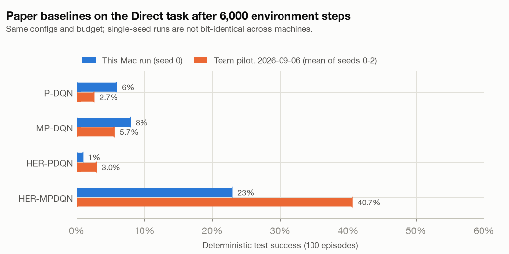
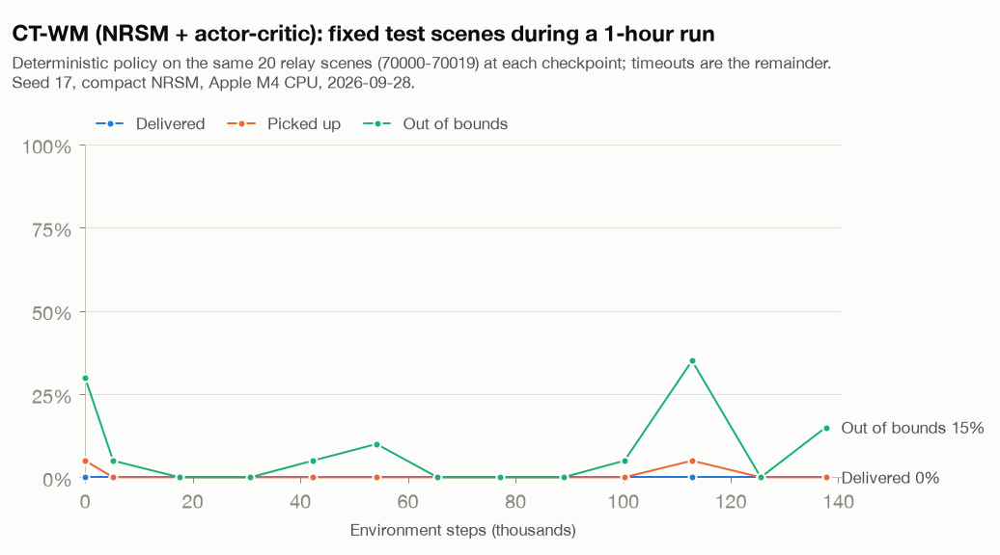
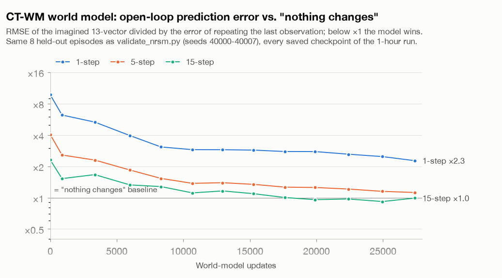
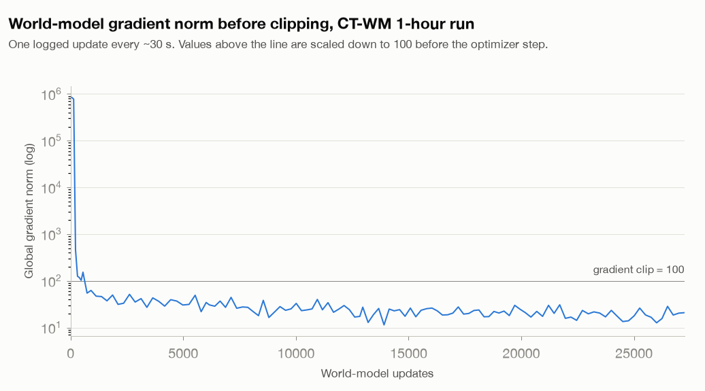

# First run on a Mac: 2026-09-28

**Who and why:** Brian Zhou, joining the project. This is a first end-to-end check that both code lines install,
pass their tests and train on a laptop, using the team's own entry points and protocols. **No code or configuration
files were changed.** On macOS, `tensorflow==2.21.0` has to be installed explicitly, because `requirements.txt`
only pins it for Linux and Windows.

**Setup:**

- Machine: Apple M4 (4 performance + 6 efficiency cores), 16 GB RAM, macOS 15.6.1. **CPU only**.
- Code: `MadaoShall-1/CTM@14d29c2`.
- Python 3.12.12.
  - World-model environment: TensorFlow 2.21.0, TensorFlow Probability 0.25.0, gymnasium 1.3.0, numpy 2.3.5
    (resolved from `requirements.txt`, which caps numpy below 2.4).
  - Baseline environment: PyTorch 2.14.0, gymnasium 1.3.0, numpy 2.5.3.

All numbers below are short, single-seed engineering checks. **They are not benchmark results.** See
[HANDBOOK §8](../../HANDBOOK.md#8-results-so-far) for the team's longer runs.

## 1. Test suites

| Suite | Result | Notes |
|---|---|---|
| `her_mpdqn_reproduction` (pytest) | **72 / 72 passed** (8 s) | |
| `Dreamer V2/.../tests` (unittest) | **123 / 129 passed** (28 s) | The 6 failures below come from the platform or from provenance checks. None is a model bug |
| `test_navigation_fixes`, `test_replay_sampling` | **14 / 14 passed** | |

The six non-passing DV2 tests:

- **`test_pause_after_seed1` × 2:** `pause_after_seed1.py` reads Linux `/proc/<pid>/...`, which does not exist on
  macOS. These should pass on Linux.
- **`test_prepare_kl_validation` × 3:** `prepare_kl_validation.py` requires `models.py` to have SHA-256 `c95064dd…`.
  No committed version of `models.py` has that hash, in either LF or CRLF form, so this fails on any fresh clone.
  It is a stale guard in a one-off experiment-prep script; the team should update or relax it.
- **`test_ctm_parity` (fixture `unet_depth2`) × 1:** 1 of 48 values differs from the official CTM by 8.2e-6, just
  over the tolerance (~6.7e-6). This is floating-point summation order on Apple ARM vs. x86. The three other
  fixtures, including the configuration actually used, pass, and the SynapseUNET variant is not used by default.

## 2. Is the task solvable? (`controller_baseline.py`)

The hand-written exact-state controller on relay scenes 60000–60099 achieves **100% pickup, 100% delivery, 0% out of
bounds, 58.78 mean steps**. This is **identical** to the team's 2026-09-14 number on the same scenes, so the
environment reproduces exactly on this machine. File: `controller_relay_seeds60000-60099.json`.

## 3. NRSM world model offline (`validate_nrsm.py --updates 100`)

Compact profile, 356,409 parameters (the same count as the team's run). Training data: 16 episodes (half
controller, half random); evaluation on 8 held-out episodes. Total time **19 s**, including data collection,
evaluation and the restore check.

| Held-out metric (normalised 13-vector RMSE, lower is better) | Before | After 100 updates | "Nothing changes" baseline |
|---|---:|---:|---:|
| Posterior reconstruction | 1.010 | 0.787 | n/a |
| Prior, 1 step | 1.049 | 0.787 | 0.108 |
| Open loop, 5 steps | 1.063 | 0.793 | 0.264 |
| Open loop, 15 steps | 1.034 | 0.797 | 0.448 |
| Reward RMSE (posterior) | 0.828 | 0.498 | n/a |
| Discount BCE (posterior) | 0.636 | 0.116 | n/a |

- The model learns: vector errors drop by 22–25%, reward error by 40%, discount BCE by 82%.
- It is still far worse than simply predicting "the next observation equals this one".
- Posterior and prior errors are identical (0.787). After 100 updates the current observation barely changes the
  prediction yet. In NRSM v2 it can only act through the stochastic latent.
- Gradient norms before clipping reached up to **9.6e8**, and **every one of the 100 updates was clipped** (clip = 100).
- This matches the team's 2026-09-16 observation of a ~2.5e6 norm, and §5 shows that the spikes fade later in training.

Files: `nrsm_offline_{result,progress,manifest}.json`.

## 4. Paper baselines, Direct task, 6,000 steps (`run_all_baselines.py`)

The protocol is the team's v2 pilot (`EXPERIMENT_ANALYSIS_AND_SCENARIO_ISSUES.md` §4):

- 6,000 environment steps and 200,000 updates per run, paper configs;
- 100 deterministic test episodes (seed 100000);
- **seed 0 only**; 4 CPU workers; about 5 minutes in total.

| Algorithm | Test success | Team pilot (mean of 3 seeds) | Mean test length | Test episodes that touched a wall | Final Q-loss |
|---|---:|---:|---:|---:|---:|
| P-DQN | 6% | 2.7% ± 3.1 | 96.9 | 82% | 5.7e3 (diverging) |
| MP-DQN | 8% | 5.7% ± 4.9 | 95.7 | 49% | 2.9 |
| HER-PDQN | 1% | 3.0% ± 2.2 | 99.8 | 39% | **1.6e12 (diverged)** |
| **HER-MPDQN** | **23%** | **40.7% ± 10.9** (56 / 34 / 32) | 86.7 | 32% | 0.43 |

<picture>
  <source media="(prefers-color-scheme: dark)" srcset="baselines_direct_6000_steps_dark.png">
  
</picture>

- The qualitative picture reproduces: **HER-MPDQN is clearly the best and the only numerically stable method.**
  Several other runs diverge.
- The exact numbers do not reproduce. Seed 0 gives 23% here vs. 56% in the team's run: RL runs are chaotic, and
  float rounding differs across CPUs and library versions.
- HER relabel counts match closely: 23,640 / 23,586 here vs. 23,608 / 23,580 for the team.

Files: `baselines_direct_6000steps_{aggregate.json,aggregate.csv,per_run.jsonl}`.

## 5. CT-WM end to end, 1 hour (`train_nrsm_online.py --duration-seconds 3600`)

This follows the team's `NRSM_ONLINE_AC_PROTOCOL_20260916.md` with every default unchanged:

- seed 17; compact NRSM;
- ≥ 1,000 random prefill steps, then 50 world-model warm-up updates;
- then one joint world-model + actor + critic update every 5 policy steps;
- batch 2 full episodes, 32 imagination starts, horizon 15;
- **no demonstrations, and the actor reads only the latent state**.

The first ~9 minutes shared the CPU with the baseline suite.

**Throughput.** In 3,602 s the run collected **137,680 environment steps** (1,030 random + 136,650 policy) and made
**27,380 world-model updates and 27,330 actor-critic updates** over 1,552 episodes. The checkpoint restore check
passed. The team's 1-hour run on an RTX 5070 Ti laptop GPU (`NRSM_FULL_RUN_20260916.md`) reached 8,400 steps and
1,524 world-model updates. **The M4 CPU is ~16× faster for this tiny batch-2 model.** At this rate the team's
300k-step target takes ~2.2 h here instead of the estimated 35–40 h.

**Task performance: nothing learned yet.** Deterministic evaluation, with the latent argmax and the actor's mode:

| Scenes | Delivered | Picked up | Timeout | Out of bounds | Mean length |
|---|---:|---:|---:|---:|---:|
| Fixed 70000–70019, before training | 0% | 5% | 70% | 30% | 86.4 |
| Fixed 70000–70019, after 1 h | 0% | 0% | 85% | 15% | 93.8 |
| Fresh 71000–71049, after 1 h | 0% | 2% | 82% | 18% | 93.2 |

<picture>
  <source media="(prefers-color-scheme: dark)" srcset="ctwm_1h_fixed_scene_eval_dark.png">
  
</picture>

**The actor stayed a random policy.** Per-episode action statistics over all 1,552 training episodes
(`action_stats.py`) show that sampled behaviour never departs from the random prefill:

| Training episodes | MOVE share | Mean MOVE param | Mean \|TURN param\| | Mean speed | Final distance to active goal | Pickup | Out of bounds |
|---|---:|---:|---:|---:|---:|---:|---:|
| Random prefill (12) | 0.50 | +0.05 | 0.48 | 7.4 m/step | 1,151 m | 0.0% | 33% |
| Policy, 1st quarter (385) | 0.50 | +0.01 | 0.52 | 7.1 m/step | 1,023 m | 0.8% | 25% |
| Policy, 2nd quarter (385) | 0.51 | +0.02 | 0.52 | 7.0 m/step | 1,025 m | 1.8% | 28% |
| Policy, 3rd quarter (385) | 0.51 | +0.02 | 0.51 | 7.1 m/step | 1,010 m | 1.0% | 28% |
| Policy, 4th quarter (385) | 0.50 | +0.01 | 0.51 | 6.7 m/step | 1,024 m | 2.1% | 24% |

A uniformly random action gives MOVE share 0.5, mean parameter 0 and mean |parameter| 0.5, which is what every row shows.
The actor's gradient norm has a median of **0.012**, versus 0.43 for the critic.

**Hypothesis, not yet tested.** CT-WM's actor loss is DreamerV2's actor loss without its behaviour-cloning term:
`−0.1·(REINFORCE + 0.1·dynamics) − (0.03·H_discrete + 0.02·H_parameter)`.

- In DreamerV2, the ×0.1 imagination scale is fine, because 5× BC on demonstrations does most of the teaching.
- In CT-WM, the ×0.1-scaled RL signal is the *only* learning signal. The entropy bonus, which pushes toward
  randomness, is not scaled down.
- A cheap test: rerun this protocol with `imagination_scale=1.0` (and/or smaller entropy coefficients) and compare
  the action statistics and evaluation. This changes one variable at a time.
- Weak supporting evidence: in the documented 400-step DreamerV2 CPU smoke run (tiny model, BC active,
  `actor_bc_loss` 1.76), the actor gradient norm is ~9.7, against ~0.01 here. The models and budgets differ, so this
  is only suggestive.

**The world model *is* learning.** `eval_ctwm_world_model.py` scored all 13 checkpoints on the same 8 held-out
episodes as the offline check. Its numbers at step 0 match the offline "before" column exactly, which validates the
script.

| World-model updates | Posterior RMSE | Open-loop 1 step (persistence 0.108) | 5 steps (0.264) | 15 steps (0.448) | Reward RMSE |
|---:|---:|---:|---:|---:|---:|
| 0 | 1.010 | 1.049 | 1.063 | 1.034 | 0.828 |
| 885 | 0.448 | 0.671 | 0.677 | 0.683 | 0.113 |
| 5,990 | 0.329 | 0.426 | 0.486 | 0.594 | 0.119 |
| 12,944 | 0.298 | 0.311 | 0.367 | 0.520 | 0.111 |
| 19,896 | 0.292 | 0.299 | 0.330 | **0.429** | 0.114 |
| 24,961 | 0.258 | 0.267 | 0.303 | **0.412** | 0.115 |
| 27,380 (end) | 0.217 | 0.244 | 0.295 | 0.444 | 0.111 |

<picture>
  <source media="(prefers-color-scheme: dark)" srcset="ctwm_1h_world_model_vs_persistence_dark.png">
  
</picture>

- By the end, the model is on par with "nothing changes" at 15 steps (it beats it at several late checkpoints) and
  close to it at 5 steps. It is still 2.3× worse at 1 step.
- It is still improving when the hour ends.
- These held-out episodes are half controller flights, which the replay (random-like behaviour) never contains, so
  they are partly out of distribution.

**The gradient explosion is transient.** The world-model gradient norm before clipping starts at ~8e5, is last
above the clip threshold (100) at update 552, and then stays at a median of 23 (final value 21). The 100-update
offline check in §3 never left this initial phase, which is why every one of its updates was clipped.

<picture>
  <source media="(prefers-color-scheme: dark)" srcset="ctwm_1h_model_gradient_norm_dark.png">
  
</picture>

Files: `ctwm_online_1h_{result,manifest}.json`, `ctwm_online_1h_evaluations.json` (per-scene outcomes),
`ctwm_online_1h_train_log.csv`, `ctwm_online_1h_episodes.csv`, `ctwm_online_1h_action_stats.csv`,
`ctwm_online_1h_world_model_evals.json`.

## 6. Take-aways

1. **Everything installs, tests and runs on a Mac.** The environment reproduces the team's controller numbers
   exactly, and the baselines reproduce qualitatively.
2. **Use CPUs for the compact CT-WM.** It ran ~16× faster on the laptop CPU than on the team's GPU. GPUs matter only
   for the default-size DreamerV2/NRSM, or for many runs at once.
3. **In CT-WM the world model learns but the actor does not.** After 137k steps the policy is statistically
   indistinguishable from random. The next experiment should target the actor objective (the imagination scale and
   entropy terms inherited from the BC-driven DreamerV2), not the CTM core.
4. **The huge gradients are an early-training transient** (the first ~550 updates) and not a persistent instability.
   It is still worth checking whether they harm the early representation.
5. The world model reaches parity with the persistence baseline at 5–15 steps within an hour. **It still has to beat
   it clearly** before imagination can be trusted for planning.
   - **Follow-up, same day:** four changes were tested with pre-registered criteria
     ([`../2026-09-28_ctwm_actor_ablation/`](../2026-09-28_ctwm_actor_ablation/README.md)):
     - an actor-objective fix and a learned-variance reward head, which both failed;
     - a one-step motion head, which cut the world model's step-to-step position error from ~200 m to ~1–3 m;
     - a normalised reward target, which made ordinary-step reward predictions accurate. The actor then learned to
       exploit a missing terminal penalty and flew off the map (94%).
     - Delivery is 0% in every run.
6. Housekeeping for the team: the stale `models.py` hash guard in `prepare_kl_validation.py`; the Linux-only
   `pause_after_seed1` test; the ARM tolerance of the `unet_depth2` parity fixture; and the iCloud venv trap on macOS
   (HANDBOOK §9).

## 7. Reproduce

The commands below run from the repo root; the environments live in `~/.venvs/` (see HANDBOOK §10.1).

```bash
cd her_mpdqn_reproduction
~/.venvs/ctm-baseline/bin/python -m pytest -q
~/.venvs/ctm-baseline/bin/python scripts/run_all_baselines.py --environments direct --seeds 0 \
  --steps 6000 --eval-episodes 100 --workers 4 --worker-threads 1 --output-root outputs/<new>
cd "../Dreamer V2/ctm_qiwei/Dreamer-master"
export PYTHONPATH="$PWD:$PWD/tests" TF_CPP_MIN_LOG_LEVEL=2
~/.venvs/ctm-dreamer/bin/python -B -m unittest discover -s tests
~/.venvs/ctm-dreamer/bin/python -B controller_baseline.py --task relay --episodes 100 --seed-start 60000 --output outputs/<new>/controller.json
~/.venvs/ctm-dreamer/bin/python -B validate_nrsm.py --output outputs/<new> --updates 100
~/.venvs/ctm-dreamer/bin/python -B -u train_nrsm_online.py --output outputs/<new> --duration-seconds 3600
```

To regenerate every small file and figure in this folder from the run directory, run this self-contained block
from the repo root:

```bash
cd reports/2026-09-28_first_run_mac
RUN="../../Dreamer V2/ctm_qiwei/Dreamer-master/outputs/<run>"
~/.venvs/ctm-baseline/bin/python extract_ctwm_run.py "$RUN" ctwm_online_1h
~/.venvs/ctm-baseline/bin/python action_stats.py "$RUN" ctwm_online_1h_action_stats.csv
mkdir -p /tmp/ctwm_sweep && for c in "$RUN"/checkpoint_env*.pkl; do
  ~/.venvs/ctm-dreamer/bin/python -B eval_ctwm_world_model.py "$c" "/tmp/ctwm_sweep/$(basename "$c" .pkl).json"; done
python3 -c "import json, glob; rows = sorted((json.load(open(p)) for p in glob.glob('/tmp/ctwm_sweep/*.json')), key=lambda r: r['counts']['model_updates']); json.dump(rows, open('ctwm_online_1h_world_model_evals.json', 'w'), indent=1)"
~/.venvs/ctm-baseline/bin/python make_figures.py
```

`../2026-09-28_ctwm_actor_ablation/sweep_world_model.py` does the world-model sweep in one process and gives
identical results.

## Files in this folder

| File | Content |
|---|---|
| `controller_relay_seeds60000-60099.json` | Per-scene controller outcomes |
| `nrsm_offline_*.json` | Offline NRSM result, progress log, manifest (config and source hashes) |
| `baselines_direct_6000steps_*` | Per-run and aggregate baseline results |
| `ctwm_online_1h_*` | CT-WM run: evaluations (with per-scene outcomes), training log, per-episode outcomes, `result.json`, `manifest.json` |
| `*_light.png`, `*_dark.png` | Figures (`make_figures.py`) |
| `extract_ctwm_run.py`, `action_stats.py`, `eval_ctwm_world_model.py`, `make_figures.py` | Scripts that produce the files above |

Checkpoints, replay and full logs stay local under each code line's git-ignored `outputs/mac_first_run_20260928/`.
